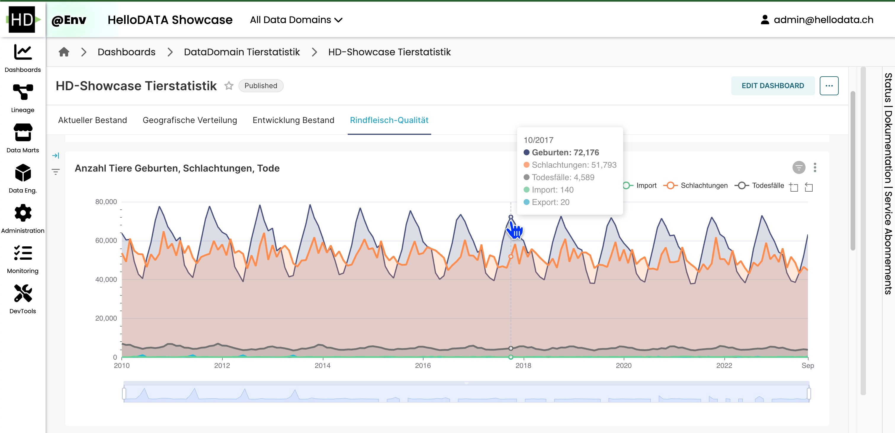

🇬🇧 [English](README.md) | 🇩🇪 [Deutsch](README.de.md)

# HelloDATA BE: Open-Source Enterprise Data Platform

> Die offene Enterprise-Datenplattform in einem einzigen Portal

HelloDATA BE integriert die Leistungsfähigkeit von Open-Source-Tools in eine einheitliche, unternehmensgerechte
Datenplattform. Sie vereinfacht das End-to-End-Datenmanagement durch die Kombination von Tools wie dbt, Airflow und
Superset, basierend auf einer robusten Postgres-Datenbank. Unsere Plattform verbindet die Flexibilität von Open Source
mit der Zuverlässigkeit von Unternehmenslösungen und optimiert Ihren Datenworkflow in einem zugänglichen Portal.

<!--  -->


## Vision und Ziel

Agile und transparente Datenplattformen sind in einer sich schnell entwickelnden digitalen Welt unerlässlich. HelloDATA
BE bietet eine Open-Source-Lösung, die speziell auf die Anforderungen von Unternehmen zugeschnitten ist. Unsere Mission
ist es, Daten zu demokratisieren und Innovation im Datenmanagement von Anfang bis Ende zu
fördern. [Mehr erfahren](docs/docs/vision/vision-and-goal.md).

## Schnellstart

**Grundlegende Einrichtung**

1. **Einstellungen für Docker Desktop**: Mac-Benutzer sollten die Einstellungen von Docker Desktop für
   Multi-Plattform-Unterstützung anpassen (insbesondere für Benutzer mit einem
   Arm64-Chip). [Details](hello-data-deployment/docker-compose/README.md#mac).
2. **Hosts-Datei-Eintrag**: Fügen Sie sicher, dass `127.0.0.1 host.docker.internal` in `/etc/hosts` hinzugefügt wurde.
   Unter Windows muss dies in den Docker Desktop WSL-Einstellungen aktiviert
   werden. [Anleitung](hello-data-deployment/docker-compose/README.md#prepare-environment).

**Startanleitung**

Wechseln Sie in das Verzeichnis `hello-data-deployment/docker-compose` und führen Sie aus:

```sh
docker-compose up -d
```

Das Herunterladen aller Images und das Starten der Container kann einige Zeit in Anspruch nehmen. Nach Abschluss können
Sie das Webportal unter [localhost:8080](http://localhost:8080) (Standard: admin/admin) aufrufen.

> **Hinweis:**
> - Ausführliche Startanleitungen, Fehlerbehebung und FAQs finden Sie in
    der [docker-compose README](hello-data-deployment/docker-compose/README.md).
> - Spezielle Einrichtungsinformationen für [Windows-Benutzer](hello-data-deployment/docker-compose/README.md#windows).

## Hauptfunktionen

HelloDATA BE ist mehr als nur eine Plattform; es ist eine umfassende Datenlösung:

- Einheitliche Enterprise-Datenplattform mit nahtlos integrierten Open-Source-Tools.
- Domänenspezifische Architektur für effektive Datenverwaltung.
- Leistungsfähige Datenmodellierung mit Verfolgung der Datenherkunft.
- Echtzeit-Einblicke in Ausführungen und Orchestrierungen.
- Erstellung und gemeinsame Nutzung von Dashboards für das gesamte Unternehmen.

## Architektur und Komponenten

HelloDATA BE basiert auf einer modularen und erweiterbaren Architektur, unterstützt
durch [NATS](https://nats.io/), [Keycloak](https://www.keycloak.org/) und weitere Technologien, die eine sichere,
effiziente und flexible Datenverarbeitung
gewährleisten. [Entdecken Sie die Architektur](docs/docs/architecture/architecture.md).

### [Domänenansicht](docs/docs/architecture/architecture.md): Geschäfts- und Daten-Domänen

Die verschiedenen Ansichten sind ein zentraler Bestandteil von HelloDATA BE. Die Hinzufügung mehrerer Geschäftsdomänen
mit n Daten-Domänen macht es von Haus aus unternehmensfähig.

- **Geschäftsdomäne**: Kernservices, einschließlich Portal, Orchestrierung und Überwachung.
- **Daten-Domäne**: Der Kern der Datenspeicherung, einschließlich Tabellen/Schemas, dbt-Datenmodellen, Data Marts,
  DWH-Umgebungen und mehr.

In jeder Geschäftsdomäne koexistieren mehrere Daten-Domänen, die jeweils über dedizierten Speicher und spezialisierte
Datenmodelle verfügen. [Erfahren Sie mehr](docs/docs/architecture/architecture.md). Weitere Details finden Sie
im [Benutzerhandbuch](docs/docs/manuals/user-manual.md).

> **[Dokumentationswebsite](https://kanton-bern.github.io/hellodata-be):** Alle Referenzen und
> Entwicklerdokumentationen, die hier auf GitHub zu finden sind, sind auch als Website für mehr Komfort verfügbar.

## Beitragen zu HelloDATA BE

Werden Sie Teil unserer Entwicklungsreise:

- [Entwickler-Richtlinien](CONTRIBUTING.md)
- HelloDATA BE Architektur
    - [Verwendeter Datenstack](docs/docs/architecture/data-stack.md)
    - [Architekturübersicht](docs/docs/architecture/architecture.md)
    - [Infrastruktur-Einblicke](docs/docs/architecture/infrastructure.md)

## Entwicklungsstatus

Bleiben Sie mit unseren Fortschritten und Plänen auf dem Laufenden, indem Sie
unsere [Roadmap](docs/docs/vision/roadmap.md) verfolgen, oder nehmen Sie über Diskussionen oder PR/Issue Kontakt mit uns
auf.

## Mitwirkende

- [Adrian Berger](https://github.com/adberger) (Entwickler)
- Andreea Hansel (Tester)
- [Dario Bagatto](https://github.com/bedag-bad) (Entwickler)
- [Lorin Reber](https://github.com/lreber) (Produktinhaber, Value-Lead)
- [Micha Eichmann](https://github.com/michadavid) (Entwickler)
- [Michael Disteli](https://www.linkedin.com/in/michael-disteli-0044311b7/) (Produktmanager)
- [Nicolas Schmid](https://github.com/nschmid) (Initialentwickler & Architekt)
- [Rajib Mitra](https://github.com/ramich) (Entwickler)
- [Simon Späti](https://github.com/sspaeti) (Entwickler)
- [Slawomir Wieczorek](https://github.com/wieczorslawo) (Entwickler)
- [Thomas Amlang](https://github.com/Thomas-Amlang) (Entwickler)

(in alphabetischer Reihenfolge)

## Lizenz

HelloDATA BE wird unter der [BSD 3-Clause Lizenz](LICENSE) veröffentlicht.
Copyright (c) 2024 Kanton Bern.

## Kontakt

Wir empfehlen, hier auf GitHub eine Diskussion zu starten oder ein Issue zu erstellen. Alternativ können Sie uns
unter [info-hd-be@bedag.ch](mailto:info-hd-be@bedag.ch) erreichen.
