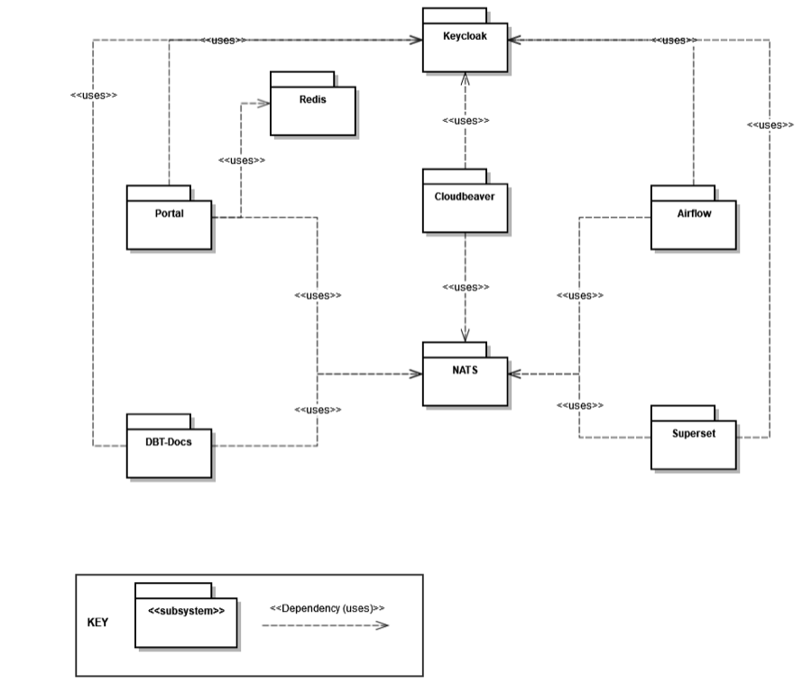

# Architecture

## Components
This chapter will explain the core architectural component, its context views, and how HelloDATA works under the hood.

### Domain View

We separate between two main domains, "Business and Data Domain.

#### Business vs. Data Domain

- **"Business" domain**: This domain holds one customer or company with general services (portal, orchestration, docs, monitoring, logging). Every business domain represents a business tenant. HelloDATA is running on a Kubernetes cluster. A business domain is treated as a dedicated namespace within that cluster; thus, multi-tenancy is set up by various namespaces in the Kubernetes cluster.
- **Data Domain**: This is where actual data is stored (db-schema). We combine it with a superset instance (related dashboards) and the documentation about these data. Currently, a business domain relates 1 - n to its Data Domains. Within an existing Business Domain a Data Domain can be spawned using Kubernetes deployment features and scripts to set up the database objects.

Resources encapsulated inside a **Data Domain** can be:

- Schema of the Data Domain
- Data mart tables of the Data Domain
- The entire DWH environment of the Data Domain
- Data lineage documents of the DBT projects of the Data Domain.
    Dashboards, charts, and datasets within the superset instance of a Data Domain.
- Airflow DAGs of the Data Domain.
- JupyterHub

On top, you can add **subsystems**. This can be seen as extensions that make HelloDATA pluggable with additional tools. We now support [CloudBeaver](https://github.com/dbeaver/cloudbeaver) for viewing your Postgres databases, RtD, and Gitea. You can imagine adding almost infinite tools with capabilities you'd like to have (data catalog, semantic layer, specific BI tool, Jupyter Notebooks, etc.).

Read more about Business and Data Domain access rights in [Roles / Authorization Concept](../manuals/role-authorization-concept.md).

#### Data Domain

Zooming into several Data Domains that can exist within a Business domain, we see an example of Data Domain A-C. Each Data Domain has a persistent storage, in our case, Postgres (see more details in the [Infrastructure Storage](https://wiki.bedag.ch/pages/viewpage.action?pageId=1040683176#HDTechArchitecture&Concepts-Storage(DataDomain)) chapter below).

Each data domain might import different source systems; some might even be used in several data domains, as illustrated. Each Data Domain is meant to have its data model with straightforward to, in the best case, layered data models as shown on the image with:

##### Landing/Staging Area
Data from various source systems is first loaded into the Landing/Staging Area.

- In this first area, the data is stored as it is delivered; therefore, the stage tables' structure corresponds to the interface to the source system.
- No relationships exist between the individual tables.
- Each table contains the data from the final delivery, which will be deleted before the next delivery.
- For example, in a grocery store, the Staging Area corresponds to the loading dock where suppliers (source systems) deliver their goods (data). Only the latest deliveries are stored there before being transferred to the next area.

##### Data Storage (Cleansing Area)
It must be cleaned before the delivered data is loaded into the Data Processing (Core). Most of these cleaning steps are performed in this area.

- Faulty data must be filtered, corrected, or complemented with singleton (default) values.
- Data from different source systems must be transformed and integrated into a unified form.
- This layer also contains only the data from the final delivery.
- For example, In a grocery store, the Cleansing Area can be compared to the area where the goods are commissioned for sale. The goods are unpacked, vegetables and salad are washed, the meat is portioned, possibly combined with multiple products, and everything is labeled with price tags. The quality control of the delivered goods also belongs in this area.

##### Data Processing (Core)
The data from the different source systems are brought together in a central area, the Data Processing (Core), through the Landing and Data Storage and stored there for extended periods, often several years. 

- A primary task of this layer is to integrate the data from different sources and store it in a thematically structured way rather than separated by origin.
- Often, thematic sub-areas in the Core are called "Subject Areas."
- The data is stored in the Core so that historical data can be determined at any later point in time. 
- The Core should be the only data source for the Data Marts.
- Direct access to the Core by users should be avoided as much as possible.

##### Data Mart
Subsets of the data from the Core are stored in a form suitable for user queries. 

- Each Data Mart should only contain the data relevant to each application or a unique view of the data. This means several Data Marts are typically defined for different user groups and BI applications.
- This reduces the complexity of the queries, increasing the acceptance of the DWH system among users.
- For example, The Data Marts are the grocery store's market stalls or sales points. Each market stand offers a specific selection of goods, such as vegetables, meat, or cheese. The goods are presented so that they are accepted, i.e., purchased, by the respective customer group.

!!! note "Between the layers, we have lots of **Metadata**"

    Different types of metadata are needed for the smooth operation of the Data Warehouse. Business metadata contains business descriptions of all attributes, drill paths, and aggregation rules for the front-end applications and code designations. Technical metadata describes, for example, data structures, mapping rules, and parameters for ETL control. Operational metadata contains all log tables, error messages, logging of ETL processes, and much more. The metadata forms the infrastructure of a DWH system and is described as "data about data".

##### Example: Multiple Superset Dashboards within a Data Domain

Within a Data Domain, several users build up different dashboards. Think of a dashboard as a specific use case e.g., Covid, Sales, etc., that solves a particular purpose. Each of these dashboards consists of individual charts and data sources in superset. Ultimately, what you see in the HelloDATA portal are the dashboards that combine all of the sub-components of what Superset provides.

### Portal/UI View

As described in the intro. The portal is the heart of the HelloDATA application, with access to all critical applications.

**Entry page of helloDATA**: When you enter the portal for the first time, you land on the dashboard where you have

1. Navigation to jump to the different capabilities of helloDATA
2. Extended status information about
    1. data pipelines, containers, performance, and security
    2. documentation and subscriptions
3. User and profile information of logged-in users. 
4. Choosing the data domain you want to work within your business domain
5. Overview of your dashboards
6. dbt linage docs
7. Data marts of your Postgres database
8. Answers to freuqently asked questions

More technical details are in the "Module deployment view" chapter below.

### Module View and Communication

#### Modules

Going one level deeper, we see that we use different modules to make the portal and helloDATA work. 

We have the following modules:

- [Keycloak](https://www.keycloak.org/): Open-source identity and access management. This handles everything related to user permissions and roles in a central place that we integrate into helloDATA.
- [Redis](https://redis.io/): open-source, in-memory data store that we use for persisting technical values for the portal to work. 
- [NATS](https://nats.io/): Open-source connective technology for the cloud. It handles communication with the different tools we use.
- **Data Stack**: We use the open-source data stack with dbt, Airflow, and Superset. See more information in the intro chapters above. Subsystems can be added on demand as extensible plugins.

##### What is Keycloak and how does it work?

At the center are two components, NATS and Keycloak. **Keycloak**, together with the HelloDATA portal, handles the authentication, authorization, and permission management of HelloDATA components. Keycloak is a powerful open-source identity and access management system. Its primary benefits include:

1. **Ease of Use**: Keycloak is easy to set up and use and can be deployed on-premise or in the cloud.
2. **Integration**: It integrates seamlessly with existing applications and systems, providing a secure way of authenticating users and allowing them to access various resources and services with a single set of credentials.
3. **Single Sign-On**: Keycloak takes care of user authentication, freeing applications from having to handle login forms, user authentication, and user storage. Users can log in once and access all applications linked to Keycloak without needing to re-authenticate. This extends to logging out, with Keycloak offering single sign-out across all linked applications.
4. **Identity Brokering and Social Login**: Keycloak can authenticate users with existing OpenID Connect or SAML 2.0 Identity Providers and easily enable social network logins without requiring changes to your application's code.
5. **User Federation**: Keycloak has the capacity to connect to existing LDAP or Active Directory servers and can support custom providers for users stored in other databases.
6. **Admin Console**: Through the admin console, administrators can manage all aspects of the Keycloak server, including features, identity brokering, user federation, applications, services, authorization policies, user permissions, and sessions.
7. **Account Management Console**: Users can manage their own accounts, update profiles, change passwords, setup two-factor authentication, manage sessions, view account history, and link accounts with additional identity providers if social login or identity brokering has been enabled.
8. **Standard Protocols**: Keycloak is built on standard protocols, offering support for OpenID Connect, OAuth 2.0, and SAML.
9. **Fine-Grained Authorization Services**: Beyond role-based authorization, Keycloak provides fine-grained authorization services, enabling the management of permissions for all services from the Keycloak admin console. This allows for the creation of specific policies to meet unique needs. Within HelloDATA, the HelloDATA portal manages authorization, yet if required by upcoming subsystems, this KeyCloak feature can be utilized in tandem.
10. **Two-Factor Authentication (2FA)**: This optional feature of KeyCloak enhances security by requiring users to provide two forms of authentication before gaining access, adding an extra layer of protection to the authentication process.

##### What is NATS and how does it work?

On the other hand, **NATS** is central for handling communication between the different modules. Its power comes from integrating modern distributed systems. It is the glue between microservices, making and processing statements, or stream processing.

NATS focuses on hyper-connected moving parts and additional data each module generates. It supports location independence and mobility, whether the backend process is streaming or otherwise, and securely handles all of it.

NATs let you connect mobile frontend or microservice to connect flexibly. There is no need for static 1:1 communication with a hostname, IP, or port. On the other hand, NATS lets you m:n connectivity based on subject instead. Still, you can use 1:1, but on top, you have things like load balancers, logs, system and network security models, proxies, and, most essential for us, **[sidecars](https://www.nginx.com/resources/glossary/sidecar/)**. We use sidecars heavily in connection with NATS.

NATS can be **deployed** nearly anywhere: on bare metal, in a VM, as a container, inside K8S, on a device, or in whichever environment you choose. And all fully secure.

#### Subsystem communication
Here is an example of subsystem communication. NATS, obviously at the center, handles these communications between the HelloDATA platform and the subsystems with its workers, as seen in the image below.

The HelloDATA portal has workers. These workers are deployed as extra containers with sidecars, called "Sidecar Containers". Each module needing communicating needs a sidecar with these workers deployed to communicate with NATS. Therefore, the subsystem itself has its workers to share with NATS as well.

#### Messaging component workers
Everything starts with a **web browser** session. The HelloDATA user accesses the **HelloDATA Portal** through HTTP. Before you see any of your modules or components, you must authorize yourself again, Keycloak. Once logged in, you have a Single Sign-on Token that will give access to different business domains or data domains depending on your role.

The HelloDATA portal sends an event to the EventWorkers via JDBC to the Portal database. The **portal database** persists settings from the portal and necessary configurations.

The **EventWorkers**, on the other side communicate with the different **HelloDATA Modules** discussed above (Keycloak, NATS, Data Stack with dbt, Airflow, and Superset) where needed. Each module is part of the domain view, which persists their data within their datastore.

#### Flow Chart
In this flow chart, you see again what we discussed above in a different way. Here, we **assign a new user role**. Again, everything starts with the HelloDATA Portal and an existing session from Keycloak. With that, the portal worker will publish a JSON message via UserRoleEvent to NATS. As the communication hub for HelloDATA, NATS knows what to do with each message and sends it to the respective subsystem worker.

Subsystem workers will execute that instruction and create and populate roles on, e.g., Superset and Airflow, and once done, inform the spawned subsystem worker that it's done. The worker will push it back to NATS, telling the portal worker, and at the end, will populate a message on the HelloDATA portal.

#### Building Block View

