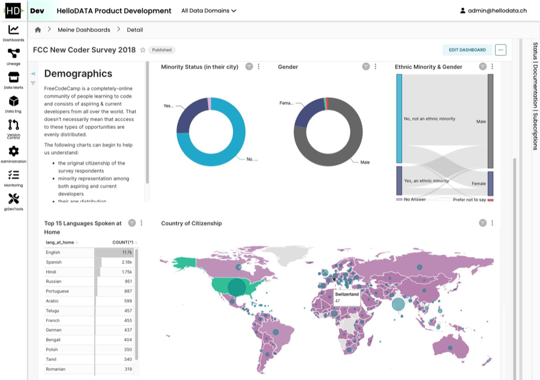

# Data Stack
We'll explain which data stack is behind HelloDATA BE.

## Control Pane - Portal

The **differentiator of HelloDATA** lies in the Portal. It combines all the loosely open-source tools into a single control pane.

The portal lets you see:

- Data models with a dbt lineage: You see the sources of a given table or even column.
- You can check out the latest runs. Gives you when the dashboards have been updated.
- Create and view all company-wide reports and dashboards.
- View your data tables as Data Marts: Accessing physical tables, columns, and schemas.
- Central Monitoring of all processes running in the portal.
- Manage and control all your user access and role permission and authorization.

You can find more about the navigation and the features in the [User Manual](../manuals/user-manual.md).

## Data Modeling with SQL - dbt

[dbt](https://www.getdbt.com/) is a small database toolset that has gained immense popularity and is the facto standard for working with SQL. Why, you might ask? SQL is the most used language besides Python for data engineers, as it is declarative and easy to learn the basics, and many business analysts or people working with Excel or similar tools might know a little already.

The declarative approach is handy as you only define the _what_, meaning you determine what columns you want in the SELECT and which table to query in the FROM statement. You can do more advanced things with WHERE, GROUP BY, etc., but you do not need to care about the _how_. You do not need to watch which database, which partition it is stored, what segment, or what storage. You do not need to know if an index makes sense to use. All of it is handled by the query optimizer of Postgres (or any database supporting SQL).

But let's face it: SQL also has its downside. If you have worked extensively with SQL, you know the spaghetti code that usually happens when using it. It's an issue because of the repeatability—no _variable_ we can set and reuse in an SQL. If you are familiar with them, you can achieve a better structure with [CTEs](https://www.ssp.sh/brain/cte/), which allows you to define specific queries as a block to reuse later. But this is only within one single query and handy if the query is already log.

But what if you'd like to define your facts and dimensions as a separate query and reuse that in another query? You'd need to decouple the queries from storage, and we would persist it to disk and use that table on disk as a FROM statement for our following query. But what if we change something on the query or even change the name we won't notice in the dependent queries? And we will need to find out which queries depend on each other. There is no [lineage](https://dagster.io/glossary/data-lineage) or dependency graph.

It takes a lot of work to be organized with SQL. There is also not a lot of support if you use a database, as they are declarative. You need to make sure how to store them in git or how to run them.

That's where dbt comes into play. dbt lets you **create these dependencies within SQL**. You can declaratively build on each query, and you'll get errors if one changes but not the dependent one. You get a lineage graph (see an [example](https://docs.getdbt.com/terms/data-lineage)), unit tests, and more. It's like you have an assistant that helps you do your job. It's added software engineering practice that we stitch on top of SQL engineering.

The danger we need to be aware of, as it will be so easy to build your models, is not to make 1000 of 1000 tables. As you will get lots of errors checked by the pre-compiling dbt,  **good data modeling techniques are essential to succeed**.

Below, you see dbt docs, lineage, and templates:
1. Project Navigation
2. Detail Navigation
3. SQL Template
4. SQL Compiled (practical SQL that gets executed)
5. Full Data lineage where with the source and transformation for the current object

Or zoom dbt lineage (when clicked):

## Task Orchestration - Airflow

[Airflow](https://airflow.apache.org/) is the natural next step. If you have many SQLs representing your business metrics, you want them to run on a daily or hourly schedule triggered by events. That's where Airflow comes into play. Airflow is, in its simplest terms, a task or workflow scheduler, which tasks or [DAGs](https://www.ssp.sh/brain/dag/) (how they are called) can be written programatically with Python. If you know [cron](https://en.wikipedia.org/wiki/Cron) jobs, these are the lowest task scheduler in Linux (think `* * * * *`), but little to no customization beyond simple time scheduling.

Airflow is different. Writing the DAGs in Python allows you to do whatever your business logic requires before or after a particular task is started. In the past, ETL tools like Microsoft SQL Server Integration Services (SSIS) and others were widely used. They were where your data transformation, cleaning and normalisation took place. In more modern architectures, these tools aren’t enough anymore. Moreover, code and data transformation logic are much more valuable to other data-savvy people (data anlysts, data scientists, business analysts) in the company instead of locking them away in a propreitary format.

Airflow or a general Orchestrator ensures correct execution of depend tasks. It is very flexibile and extensible with operators from the community or in-build capabiliities of the framework itself.

### Default View
Airflow DAGs - Entry page which shows you the status of all your DAGs
- what's the schedule of each job
- are they active, how often have they failed, etc.

Next, you can click on each of the DAGs and get into a detailed view:

### Airflow operations overview for one DAG

1. General visualization possibilities which you prefer to see (here Grid view)
2. filter your DAG runs
3. see details on each run status in one view 
4. Check details in the table view
5. Gantt view for another example to see how long each sub-task had of the DAG

### Graph view of DAG
It shows you the dependencies of your business's various tasks, ensuring that the order is handled correctly.

## Dashboards - Superset

[Superset](https://superset.apache.org/) is the entry point to your data. It's a popular open-source business intelligence dashboard tool that visualizes your data according to your needs. It's able to handle all the latest chart types. You can combine them into dashboards filtered and drilled down as expected from a BI tool. The access to dashboards is restricted to authenticated users only. A user can be given view or edit rights to individual dashboards using roles and permissions. Public access to dashboards is not supported.
### Example dashboard

### Supported Charts
*([see live in action](https://superset.datatest.ch/chart/add))*

## Storage Layer - Postgres

Let's start with the storage layer. We use Postgres, the currently [most used and loved database](https://survey.stackoverflow.co/2023/#section-most-popular-technologies-databases). Postgres is versatile and simple to use. It's a **relational database** that can be customized and scaled extensively.
