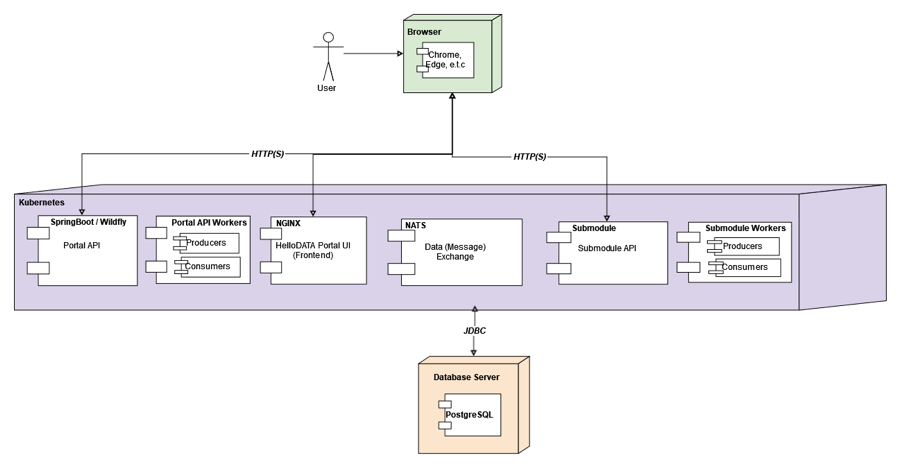

# Infrastructure

Infrastructure is the part where we go into depth about how to run HelloDATA and its components on **Kubernetes.** 

## Kubernetes

Kubernetes and its platform allow you to run and orchestrate container workloads. Kubernetes has become [popular](https://stackoverflow.blog/2020/05/29/why-kubernetes-getting-so-popular/) and is the **de-facto standard** for your cloud-native apps to (auto-) [scale-out](https://stackoverflow.com/a/11715598/5246670) and deploy the various open-source tools fast, on any cloud, and locally. This is called cloud-agnostic, as you are not locked into any cloud vendor (Amazon, Microsoft, Google, etc.).

Kubernetes is **infrastructure as code**, specifically as YAML, allowing you to version and test your deployment quickly. All the resources in Kubernetes, including Pods, Configurations, Deployments, Volumes, etc., can be expressed in a YAML file using Kubernetes tools like HELM. Developers quickly write applications that run across multiple operating environments. Costs can be reduced by scaling down and using any programming language running with a simple Dockerfile. Its management makes it accessible through its modularity and abstraction; also, with the use of Containers, you can monitor all your applications in one place.

Kubernetes [Namesspaces](https://kubernetes.io/docs/concepts/overview/working-with-objects/namespaces/) provides a mechanism for isolating groups of resources within a single cluster. Names of resources need to be unique within a namespace but not across namespaces. Namespace-based scoping is applicable only for namespaced [objects](https://kubernetes.io/docs/concepts/overview/working-with-objects/#kubernetes-objects) _(e.g. Deployments, Services, etc)_ and not for cluster-wide objects _(e.g., StorageClass, Nodes, PersistentVolumes, etc)_.

- Namespaces provide a mechanism for isolating groups of resources within a single cluster ([separation of concerns](https://en.wikipedia.org/wiki/Separation_of_concerns)). Namespaces also lets you easily wramp up several HelloDATA instances on demand. 
    - Names of resources need to be unique within a namespace but not across namespaces.
- We get central monitoring and logging solutions with [Grafana](https://grafana.com/), [Prometheus](https://prometheus.io/), and the [ELK stack (Elasticsearch, Logstash, and Kibana)](https://aws.amazon.com/what-is/elk-stack/). As well as the Keycloak single sign-on.
- Everything runs in a single Kubernetes Cluster but can also be deployed on-prem on any Kubernetes Cluster.
- Persistent data will run within the "Data Domain" and must run on a [Persistent Volume](https://kubernetes.io/docs/concepts/storage/persistent-volumes/) on Kubernetes or a central Postgres service (e.g., on Azure or internal).

## Module deployment view

Here, we have a look at the module view with an inside view of accessing the HelloDATA Portal.

The Portal API serves with [SpringBoot](https://spring.io/projects/spring-boot), [Wildfly](https://www.wildfly.org/) and [Angular](https://angular.io/).

## Storage (Data Domain)

Following up on how storage is persistent for the [Domain View](https://wiki.bedag.ch/pages/viewpage.action?pageId=1040683176#HDTechArchitecture&Concepts-DomainView) introduced in the above chapters. 

### Data-Domain Storage View

Storage is an important topic, as this is where the business value and the data itself are stored.

From a Kubernetes and deployment view, everything is encapsulated inside a Namespace. As explained in the above "Domain View", we have different layers from one Business domain (here Business Domain) to n (multiple) Data Domains. 

Each domain holds its data on **persistent storage**, whether Postgres for relational databases, blob storage for files or file storage on persistent volumes within Kubernetes.

GitSync is a tool we added to allow **GitOps**-type deployment. As a user, you can push changes to your git repo, and GitSync will automatically deploy that into your cluster on Kubernetes.

### Business-Domain Storage View
Here is another view that persistent storage within Kubernetes (K8s) can hold data across the Data Domain. If these **persistent volumes** are used to store Data Domain information, it will also require implementing a backup and restore plan for these data.

Alternatively, blob storage on any **cloud vendor or services** such as Postgres service can be used, as these are typically managed and come with features such as backup and restore.

## K8s Jobs

HelloDATA uses Kubernetes jobs to perform certain activities

### Cleanup Jobs

Contents:

- Cleaning up user activity logs
- Cleaning up logfiles

## Deployment Platforms

HelloDATA can be operated as different platforms, e.g. development, test, and/or production platforms. The deployment is based on common CICD principles. It uses GIT and flux internally to deploy its resources onto the specific Kubernetes clusters.
In case of resource shortages, the underlying platform can be extended with additional resources upon request.
Horizontal scaling of the infrastructure can be done within the given resources boundaries (e. g. multiple pods for Superset.)

## Platform Authentication Authorization

See at [Roles and authorization concept](../manuals/role-authorization-concept.md).
