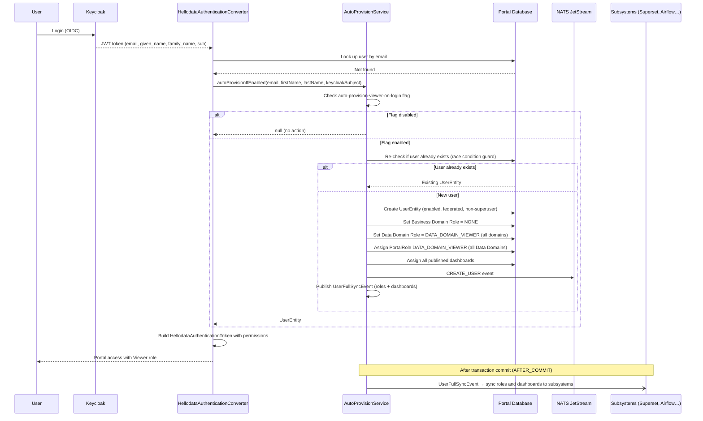

# Auto-Provisioning Viewer on Login

## Overview

The **Auto-Provision Viewer on Login** mechanism automatically creates a user account with the **Viewer** role when a
user logs into the HelloDATA portal for the first time. This eliminates the need for administrators to manually create
accounts for every new user — the user simply logs in via Keycloak, and the system automatically:

1. Creates a user account in the portal database.
2. Assigns the **DATA_DOMAIN_VIEWER** role across all available Data Domains.
3. Grants access to all published dashboards (Superset).
4. Synchronizes the user with subsystems (Superset, Airflow, etc.) via NATS.

---

## When to Use

| Scenario                                                            | Recommendation      |
|---------------------------------------------------------------------|---------------------|
| Organization with a large number of users who need read-only access | ✔ Enable            |
| Production environment with restricted access and account control   | x Disable (default) |
| Development / test environment with fast onboarding                 | ✔ Enable            |
| Manual approval of each user by an administrator is required        | x Disable           |

---

## Configuration

The mechanism is **disabled by default**. To enable it, set the following configuration property:

### application.yml

```yaml
hello-data:
  system-properties:
    auto-provision-viewer-on-login: true
```

### Environment Variable (e.g. Docker / Kubernetes)

Following the Spring Boot convention, the corresponding environment variable is:

```
HELLO_DATA_SYSTEM_PROPERTIES_AUTO_PROVISION_VIEWER_ON_LOGIN=true
```

---

## How It Works — Step-by-Step Flow



---

## What Is Created for a New User

### 1. User Account (`UserEntity`)

| Field       | Value                                   |
|-------------|-----------------------------------------|
| `id`        | UUID from Keycloak (`sub` claim in JWT) |
| `email`     | From JWT, converted to lowercase        |
| `username`  | Same as email                           |
| `firstName` | From JWT (`given_name`)                 |
| `lastName`  | From JWT (`family_name`)                |
| `enabled`   | `true`                                  |
| `superuser` | `false`                                 |
| `federated` | `true`                                  |

### 2. Context Roles

- **Business Domain**: `NONE` — the user has no administrative privileges at the Business Domain level.
- **Data Domain (all)**: `DATA_DOMAIN_VIEWER` — read-only access across all Data Domains.

### 3. Portal Roles

The `DATA_DOMAIN_VIEWER` role is immediately assigned as a `UserPortalRoleEntity` for each Data Domain. This ensures the
user has permissions (e.g. `DASHBOARDS`, `DATA_LINEAGE`) on the very first request, without waiting for NATS/sidecar
synchronization.

### 4. Dashboards

All **published** Superset dashboards (`published = true`) from all Data Domains are automatically assigned to the user.
Unpublished dashboards are skipped.

---

## Subsystem Synchronization

After the database transaction is committed, the system performs two synchronization steps:

1. **NATS `CREATE_USER`** — immediately notifies subsystems about the new user (Superset, Airflow, etc.) via JetStream.
2. **`UserFullSyncEvent`** — an asynchronous Spring event (`@TransactionalEventListener`, phase `AFTER_COMMIT`) that
   triggers a full synchronization of context roles and dashboards with subsystems.

This ensures that subsystems (e.g. Superset sidecar) create the corresponding account and permissions in their internal
databases.

---

## Concurrency Handling (Race Conditions)

The mechanism is resilient to situations where the same user logs in simultaneously from multiple windows/devices:

- The `autoProvisionIfEnabled` method runs in a **new transaction** (`Propagation.REQUIRES_NEW`).
- Before creating the account, a second check is performed to verify the user does not already exist in the database (
  double-check pattern).
- In `HellodataAuthenticationConverter`, `DataAccessException` and `PersistenceException` are caught — in case of a
  conflict (e.g. duplicate key), the system reads the existing user instead.

---

## Permissions Granted Automatically

A user with the `DATA_DOMAIN_VIEWER` role receives the following portal permissions (depending on the role configuration
in the system):

- Viewing dashboards (`DASHBOARDS`)
- Viewing data lineage (`DATA_LINEAGE`)
- Other permissions configured for the `DATA_DOMAIN_VIEWER` role

The user does **not** receive administrative permissions such as:

- User management (`USER_MANAGEMENT`)
- Pipeline management (`PIPELINES`)
- Access to developer tools
- Superuser privileges

---

## Important Notes

!!! warning "Security"
Enabling this mechanism means that **every** user authenticated in Keycloak will automatically gain access to the portal
and all published dashboards. Make sure that access to the Keycloak realm is properly secured (e.g. via LDAP/AD
federation, restricted registration).

!!! info "Changing Roles After Provisioning"
After automatic account creation, an administrator can change the user's role to a higher one (e.g.
`DATA_DOMAIN_EDITOR`, `DATA_DOMAIN_ADMIN`) or revoke access — just like for manually created accounts.

!!! tip "Cache"
After auto-provisioning, the user cache is automatically invalidated, so permissions are immediately visible without
requiring a new login.

---

## First Login User Experience

When a user logs in for the first time and auto-provisioning is active, the portal displays a **loading overlay** to
indicate that the workspace is being prepared. This overlay:

- Appears **immediately** (no entrance animation) with a card stack visual and a "Preparing your workspace" message.
- Remains visible for a brief period (~5 seconds) while subsystem synchronization completes in the background.
- **Fades out smoothly** (0.6s animation) once the preparation period ends.

During this time, the portal polls for the user's profile at a faster interval (every 5 seconds) to detect when
subsystem roles and dashboards become available. After 2 minutes, polling falls back to the normal 30-second interval.

---

## Related Components

| Component                                     | Description                                                        |
|-----------------------------------------------|--------------------------------------------------------------------|
| `SystemProperties`                            | Configuration class with the `autoProvisionViewerOnLogin` flag     |
| `AutoProvisionService`                        | Service implementing the auto-provisioning logic                   |
| `HellodataAuthenticationConverter`            | JWT → authentication token converter, entry point of the mechanism |
| `UserFullSyncEvent` / `UserSyncEventListener` | Synchronization events with subsystems after commit                |
| `RoleService`                                 | Assignment of context roles (Business Domain, Data Domain)         |
| `UserSelectedDashboardService`                | Saving selected dashboards for the user                            |
