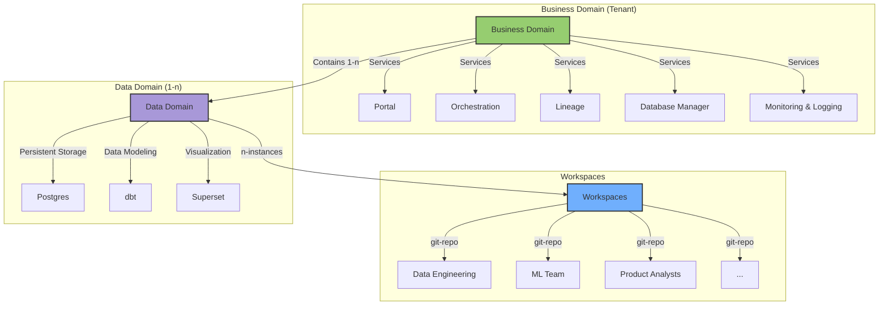

# Data Engineering Workspaces
On this page, we'll explain what workspaces in the context of HelloDATA-BE are and how to use them, and you'll create your own based on a prepared boiler-plate repo.


!!! info

    Also see the [step-by-step video](https://youtu.be/EVolsYgKnWw?si=FQcakmSJzpADHeoR) we created that might help you further.

## What is a Workspace?
Within the context of HelloDATA-BE, data, engineers, or technical people can develop their dbt, airflow, or even bring their tool, all packed into a separate git-repo and run as part of HelloDATA-BE where they enjoy the benefits of persistent storage, visualization tools, user management, monitoring, etc.


*A schematic overview of workspaces are embedded into HelloDATA-BE.*
<!----> 

A workspace can have n-instances within a data domain. What does it mean? Each team can deal with its requirements to develop and build their project independently.

Think of an ML engineer who needs heavy tools such as Tensorflow, etc., as an analyst might build simple dbt models. In contrast, another data engineer uses a specific tool from the [Modern Data Stack](https://glossary.airbyte.com/term/modern-data-stack/).

### When to use Workspaces
Workspaces are best used for **development, implementing custom business logic, and modeling your data**. But there is no limit to what you build as long as it can be run as a DAG as an Airflow data pipeline.

Generally speaking, a workspace is used whenever someone needs to create a custom logic yet to be integrated within the HelloDATA BE Platform.

As a second step - imagine you implemented a critical business transformation everyone needs - that code and DAG could be moved and be a default DAG within a data domain. But the development always happens within the workspace, enabling **self-serve**.

Without workspaces, every request would need to go over the HelloDATA BE Project team. Data engineers need a straightforward way isolated from deployment where they can add custom code for their specific data domain pipelines.

### How does a Workspace work?
When you create your workspace, it will be deployed within HelloDATA-BE and run by an Airflow [DAG](https://glossary.airbyte.com/term/dag-directed-acyclic-graph/). The Airflow DAG is the integration into HD. You'll define things like how often it runs, what it should run, the order of it, etc.

Below, you see an example of two different Airflow DAGs deployed from two different Workspaces (marked red arrow):


## How do I create my own Workspace?
To implement your own Workspace, we created a [boiler-plate repo](https://git.mgmtbi.ch/hellodata/hellodata-ws-boilerplate). This repo contains a minimal set of artefacts in order to be deployed on HD.

### Step-by-Step Guide

1. Clone [boiler-plate repo](https://git.mgmtbi.ch/hellodata/hellodata-ws-boilerplate).
2. Add your own custom logic to the repo, update Dockerfile with relevant libraries and binaries you need.
3. Create one or multiple Airflow DAGs for running within HelloDATA-BE.
4. Define needed ENV-Variables and deployments needs (to be set-up by HD-Team initially once)
5. Build a docker image
6. Ask HD Team to deploy initially

From now on whenever you have a change, you just build a new image and that will be deployed on HelloDATA-BE automatically. Making you and your team independent.

## Boiler-Plate Example
Below you find examples of the boiler-plate example that help you understand how to configure workspaces for your needs.
### Boiler-Plate repo
The [repo](https://git.mgmtbi.ch/hellodata/hellodata-ws-boilerplate) helps you to build your workspace by simply clone the whole repo and adding your changes.

We generally have these boiler plate files:
```
├── Dockerfile
├── Makefile
├── README.md
├── build-and-push.sh
├── deployment
│   └── deployment-needs.yaml
└── src
    ├── dags
    │   └── airflow
    │       ├── .astro
    │       │   ├── config.yaml
    │       ├── Dockerfile
    │       ├── Makefile
    │       ├── README.md
    │       ├── airflow_settings.yaml
    │       ├── dags
    │       │   ├── .airflowignore
    │       │   └── boiler-example.py
    │       ├── include
    │       │   └── .kube
    │       │       └── config
    │       ├── packages.txt
    │       ├── plugins
    │       ├── requirements.txt
    └── duckdb
        └── query_duckdb.py
```

#### Important files: Business logic (DAG)
Where as `query_duckdb.py` and the `boiler-example.py` DAG are in this case are my custom code that you'd change with your own code. 

Although the Airflow DAG can be re-used as we use `KubernetesPodOperator` that works works within HD and locally (check more below). Essentially you change the name and the schedule to your needs, the image name and your good to go.

Example of a Airflow DAG:
```python
from pendulum import datetime
from airflow import DAG
from airflow.configuration import conf
from airflow.providers.cncf.kubernetes.operators.kubernetes_pod import (
    KubernetesPodOperator,
)
from kubernetes.client import models as k8s
import os

default_args = {
    "owner": "airflow",
    "depend_on_past": False,
    "start_date": datetime(2021, 5, 1),
    "email_on_failure": False,
    "email_on_retry": False,
    "retries": 1,
}

workspace_name = os.getenv("HD_WS_BOILERPLATE_NAME", "ws-boilerplate")
namespace = os.getenv("HD_NAMESPACE", "default")

# This will use .kube/config for local Astro CLI Airflow and ENV variable for k8s deployment
if namespace == "default":
    config_file = "include/.kube/config"  # copy your local kube file to the include folder: `cp ~/.kube/config include/.kube/config`
    in_cluster = False
else:
    in_cluster = True
    config_file = None

with DAG(
    dag_id="run_boiler_example",
    schedule="@once",
    default_args=default_args,
    description="Boiler Plate for running a hello data workspace in airflow",
    tags=[workspace_name],
) as dag:
    KubernetesPodOperator(
        namespace=namespace,
        image="my-docker-registry.com/hellodata-ws-boilerplate:0.1.0",
        image_pull_secrets=[k8s.V1LocalObjectReference("regcred")],
        labels={"pod-label-test": "label-name-test"},
        name="airflow-running-dagster-workspace",
        task_id="run_duckdb_query",
        in_cluster=in_cluster,  # if set to true, will look in the cluster, if false, looks for file
        cluster_context="docker-desktop",  # is ignored when in_cluster is set to True
        config_file=config_file,
        is_delete_operator_pod=True,
        get_logs=True,
        # please add/overwrite your command here
        cmds=["/bin/bash", "-cx"],
        arguments=[
            "python query_duckdb.py && echo 'Query executed successfully'",  # add your command here
        ],
    )
```

#### DAG: How to test or run a DAG locally before deploying

To run locally, the easiest way is to use the [Astro CLI](https://docs.astronomer.io/astro/cli/overview) (see link for installation). With it, we can simply `astro start` or `astro stop` to start up/down.

For local deployment we have these **requirements**:

- Local Docker installed (either native or Docker-Desktop)
- make sure Kubernetes is enables
- copy you local kube-file to astro: `cp ~/.kube/config src/dags/airflow/include/.kube/`

The `config` file is used from astro to run on local Kubernetes. Se more infos on [Run your Astro project in a local Airflow environment](https://docs.astronomer.io/astro/cli/run-airflow-locally).

#### Install Requirements: `Dockerfile`

Below is the example how to install requirements (here `duckdb`) and copy my custom code `src/duckdb/query_duckdb.py` to the image.

Boiler-plate example:
```dockerfile
FROM python:3.10-slim

RUN mkdir -p /opt/airflow/airflow_home/dags/

# Copy your airflow DAGs which will be copied into bussiness domain Airflow (These DAGs will be executed by Airflow)
COPY ../src/dags/airflow/dags/* /opt/airflow/airflow_home/dags/

WORKDIR /usr/src/app

RUN pip install --upgrade pip

# Install DuckDB (example - please add your own dependencies here)
RUN pip install duckdb

# Copy the script into the container
COPY src/duckdb/query_duckdb.py ./

# long-running process to keep the container running 
CMD tail -f /dev/null
```

#### Deployment: `deployment-needs.yaml`

Below you see an an example of a deployment needs in `deployment-needs.yaml`, that defines:

- Docker image
- Volume mounts you need
- a command to run 
- container behaviour
- extra ENV variables and values that HD-Team needs to provide for you

!!! note "This part is the one that will change most likely"

	All of which will be eventually more automated. Also let us know or just add missing specs to the file and we'll add the functionallity on the deployment side.	
 

```yaml
spec:
  initContainers:
    copy-dags-to-bd:
      image:
        repository: my-docker-registry.com/hellodata-ws-boilerplate
        pullPolicy: IfNotPresent
        tag: "0.1.0"
      resources: {}

      volumeMounts:
        - name: storage-hellodata
          type: external
          path: /storage
      command: [ "/bin/sh","-c" ]
      args: [ "mkdir -p /storage/${datadomain}/dags/${workspace}/ && rm -rf /storage/${datadomain}/dags/${workspace}/* && cp -a /opt/airflow/airflow_home/dags/*.py /storage/${datadomain}/dags/${workspace}/" ]

  containers:
    - name: ws-boilerplate
      image: my-docker-registry.com/hellodata-ws-boilerplate:0.1.0
      imagePullPolicy: Always


#needed envs for Airflow
airflow:

  extraEnv: |
    - name: "HD_NAMESPACE"
      value: "${namespace}"
    - name: "HD_WS_BOILERPLATE_NAME"
      value: "dd01-ws-boilerplate"
```

## Conclusion
I hope this has illustrated how to create your own workspace. Otherwise let us know in the discussions or create an issue/PR.
