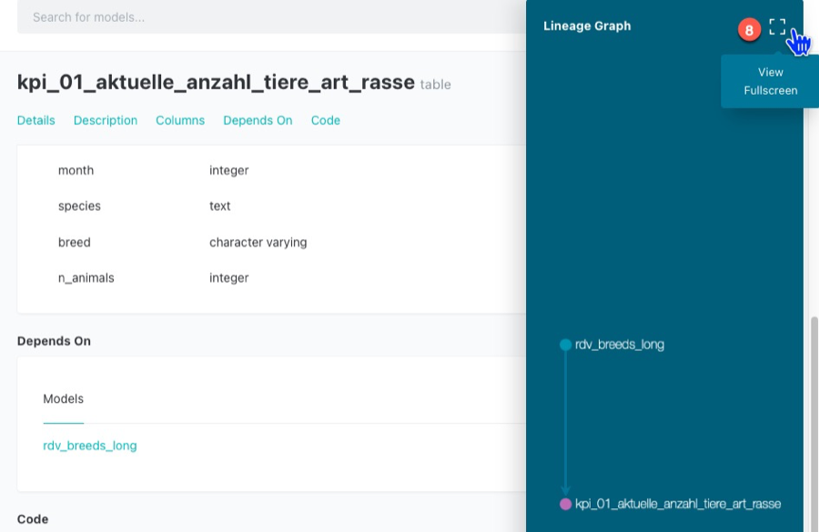
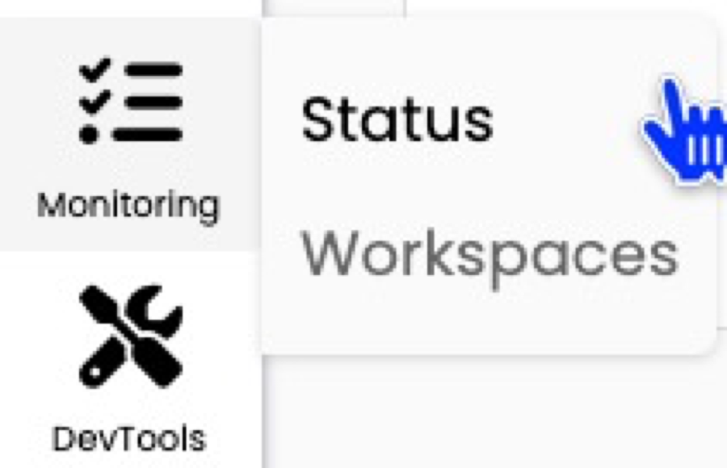
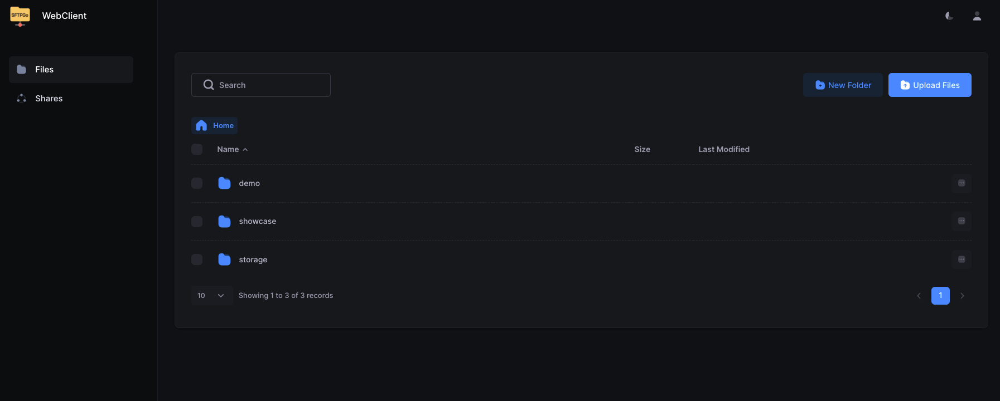

# User Manual

## Goal

This use manual should enable you to use the HelloDATA platform and illustrate the features of the product and how to
use them.

→ More about the Platform and its architecture you can find
on[Architecture & Concepts](../architecture/architecture.md).

## Navigation

### Portal

The entry page of HelloDATA is the [Web Portal](../architecture/data-stack.md#control-pane-portal).

1. Navigation to jump to the different capabilities of HelloDATA
2. Extended status information about
    1. data pipelines, containers, performance and security
    2. documentation and subscriptions
3. User and profile information of logged-in user.4. Overview of your dashboards


#### Business & Data Domain

As explained in [Domain View](../architecture/architecture.md#domain-view), a key feature is to create business domains
with n-data domains. If you have access to more than one data domain, you can switch between them by clicking the
`drop-down` at the top and switch between them.


### Dashboards

The most important navigation button is the dashboard links. If you hover over it, you'll see three options to choose
from.

You can either click the dashboard list in the hover menu (2) to see the list of dashboards with thumbnails, or directly
choose your dashboard (3).


### Data-Lineage

To see the data lineage (dependencies of your data tables), you have the second menu option. Again, you chose the list
or directly on "data lineage" (2).

Button 2 will bring you to the project site, where you choose your project and load the lineage.


Once loaded, you see all sources (1) and dbt Projects (2). On the detail page, you can see all the beautiful and helpful
documentation such as:

- table name (3)
- columns and data types (4)
- which table and model this selected object depends on (5)
- the SQL code (6)
    - as a template or complied
- and dependency graph (7)
    - which you can expand to full view (8) after clicking (7)
    - interactive data lineage view (9)





### Data Marts Viewer

This view let's you access the universaal data mart (udm) layer:


These are cleaned and modeled data mart tables. Data marts are the tables that have been joined and cleaned from the
source tables. This is effectively the latest layer of HelloDATA BE, which the Dashboards are accessing. Dashboards
should not access any layer before (landing zone, data storage, or data processing).

We use CloudBeaver for this, same as the DWH Viewer later.


### Data Engineering

#### DWH Viewer

This is essentially a database access layer where you see all your tables, and you can write SQL queries based on your
access roles with a provided tool ([CloudBeaver](https://github.com/dbeaver/cloudbeaver)).

##### Create new SQL Query

o

##### Choose Connection and stored queries

You can chose pre-defined connections and query your data warehouse. Also you can store queries that other user can see
and use as well. Run your queries with (1).


##### Settings and Powerful features

You can set many settings, such as user status, and many more.


Please find all setting and features in the [CloudBeaver Documentation](https://dbeaver.com/docs/cloudbeaver/).

#### Orchestration

The orchestrator is your task manager. You
tell [Airflow](https://wiki.bedag.ch/pages/viewpage.action?pageId=1040683176#HDTechArchitecture&Concepts-TaskOrchestration-Airflow),
our orchestrator, in which order the task will run. This is usually done ahead of time, and in the portal, you can see
the latest runs and their status (successful, failed, etc.).

- You can navigate to DAGs (2) and see all the details (3) with the DAG name, owner, runs, schedules, next run and
  recent.
- You can also dive deeper into Datasets, Security, Admin or similar (4)
- Airflow offers lots of different visualization modes, e.g. the Graph view (6), that allows you to see each step of
  this task.
    - As you can see, you can choose calendar, task duration, Gantt, etc.


##### Helper Library for Scheduling Jobs on Kubernetes

To unlock the full power of airflow on kubernetes, you will need to run your jobs in containers on the cluster.
To make this a bit easier, we provide a (preinstalled helper library)[https://github.com/bedag/hellodata-be-airflow-pod-operator-params] for you to use.

###### Library description

The helper library consists mainly of a function, that returns properly formatted parameters to use with (airflows kubernetes pod operator)[https://airflow.apache.org/docs/apache-airflow/1.10.10/_api/airflow/contrib/operators/kubernetes_pod_operator/index.html].
It is named `hellodata_be_airflow_pod_operator_params` and can be imported with `import hellodata_be_airflow_pod_operator_params`.
The two public objects are the function `get_pod_operator_params` and the class `EphemeralVolume`.

Call the function `get_pod_operator_params` to get a dictionary with parameters to be passed to `kubernetes_pod_operator`.

| Parameter                       | Type                      | Default                | Description                                                                                                   |
|----------------------------------|---------------------------|------------------------|---------------------------------------------------------------------------------------------------------------|
| `image`                         | `str`                     | _required_             | The Docker image to use for the pod.                                                                          |
| `namespace`                     | `str`                     | _required_             | The Kubernetes namespace in which to create the pod.                                                          |
| `secret_names`                  | `Optional[List[str]]`     | `None`                 | List of Kubernetes secret names to mount in the pod as environment variables.                                 |
| `configmap_names`               | `Optional[List[str]]`     | `None`                 | List of Kubernetes configmap names to mount in the pod as environment variables.                              |
| `cpus`                          | `float`                   | `1.0`                  | Number of CPU cores to allocate to the pod.                                                                   |
| `memory_in_Gi`                  | `float`                   | `1.0`                  | Amount of memory (in GiB) to allocate to the pod.                                                             |
| `mount_storage_hellodata_pvc`   | `bool`                    | `True`                 | Whether to mount the `storage-hellodata` volume under `/mnt/storage-hellodata`.                               |
| `local_ephemeral_storage_in_Gi` | `float`                   | `1.0`                  | Amount of local ephemeral storage (in GiB) to allocate to the pod.                                            |
| `startup_timeout_in_seconds`    | `int`                     | `120`                  | Timeout in seconds for the pod to start up.                                                                   |
| `large_ephemeral_storage_volume`| `Optional[EphemeralVolume]`| `None`                | Large ephemeral storage volume to allocate to the pod.                                                        |
| `env_vars`                      | `Optional[Dict[str, str]]`| `None`                 | Additional environment variables to set in the pod.                                                           |

The class `EphemeralVolume` takes the following arguments for it's constructor:

| Parameter      | Type    | Description                                                      |
|----------------|---------|------------------------------------------------------------------|
| `name`         | `str`   | The name of the ephemeral volume.                                |
| `size_in_Gi`   | `float` | The size of the volume in GiB (Gibibytes).                       |
| `mount_path`   | `str`   | The file system path inside the pod where the volume is mounted.  |
| `storage_class`| `str`   | The Kubernetes storage class to use for provisioning the volume.  |

###### Example usage

The following python code contains an Airflow DAG that makes full usage of the library to schedule a pod on airflow.

```python
import sys
import os
from datetime import timedelta
from pendulum import datetime
from airflow import DAG
from airflow.providers.cncf.kubernetes.operators.kubernetes_pod import KubernetesPodOperator
from hellodata_be_airflow_pod_operator_params import get_pod_operator_params, EphemeralVolume # library import

operator_params = get_pod_operator_params(
    'my-image:latest',
    ['my-secret-to-mount-as-env-vars'],
    ['my-configmap-to-mount-as-env-vars'],
    cpus=8, 
    memory_in_Gi=10, 
    local_ephemeral_storage_in_Gi=6,
    startup_timeout_in_seconds=10 * 60 ,
    large_ephemeral_storage_volume=EphemeralVolume('my-storage', 50, '/app/large_ephemeral_storage', 'default'),
    env_vars={'key': 'value'}
)

default_args = {
    'owner': 'airflow',
    'depend_on_past': False,
    "start_date": datetime(2025, 8, 1, tz="Europe/Zurich"),
}

with DAG(
    dag_id='run-container-on-kubernetes',
    schedule='@once',
    default_args=default_args,
    max_active_runs=1,
    dagrun_timeout=timedelta(minutes=60*5),
) as dag:

    my_task = KubernetesPodOperator(
        **operator_params,
        name='my_task',
        task_id='my_task',
        arguments=[
'''
echo "I run as a cluster and have the following env vars" &&
printenv
'''
        ],
    )
```

##### Default DAG: HelloDATA Monitoring

This is a DAG provided by us that gives you a summary of DAG runs. It will send you an email reporting which DAGs
have failed since the monitoring DAG last ran, which have run successfully, which have not run and which are still running.


The email contains three sections:
1. **Monitored DAGs** – A table with an overview of DAG runs tagged as `monitored`.
2. **Changes to DAGs** – Lists DAGs that have been paused/unpaused, are new, deleted, newly monitored (added the `monitored` tag) or newly unmonitored.
3. **General Overview** – A table with all DAG runs.

You can modify the behavior of the DAG using environment variables on the Airflow worker:

| Variable Name                    | Default Value                                                                 | Effect                                                                                                                                                                                                                       |
|----------------------------------|------------------------------------------------------------------------------|------------------------------------------------------------------------------------------------------------------------------------------------------------------------------------------------------------------------------|
| `MONITORING_DAG_STATE_FILE`      | `/opt/airflow/dag_state_cache.json`                                          | Path to a file where the state is saved. On Kubernetes, this could be on a PVC to ensure it persists after a pod restart.                                                             |
| `MONITORING_DAG_NOTIFY_EMAIL`    | `moiraine@tarvalon.org,rand.althor@aielwaste.net`                           | Comma-separated list of email addresses to send the report to. Airflow's mail server settings are used for sending the email.                                                         |
| `MONITORING_DAG_AIRFLOW_LINK`    | `your administrator has forgotten to set the MONITORING_DAG_AIRFLOW_LINK env variable` | Value used to generate direct links to the DAG runs.                                                                                                                                  |
| `MONITORING_DAG_INSTANCE_NAME`   | `HelloDATA`                                                                 | Used to generate the email title: `<MONITORING_DAG_INSTANCE_NAME> monitoring, <date and time> - DAG monitoring report`.                                                               |
| `MONITORING_DAG_RUNTIME_SCHEDULE`| `0 5 * * *`                                                                 | [Cron expression](https://en.wikipedia.org/wiki/Cron) for when to run the DAG.                                                                                                        |

#### Prebuilt Mechanism for logging DAG runs

HelloDATA offers an easy way to log your DAG run stats to your DWH database through the `log_dag_run` function in the
preinstalled python package `hellodata_be_dag_logs`.

##### `log_dag_run` function

The `log_dag_run` function logs statistics for all tasks in the current Airflow DAG run,
excluding any specified task IDs, and inserts this data into a database table.
This helps in monitoring and analyzing DAG performance over time.

**Return type:** `None`
The function does not return a value; it performs logging and database insertion as side effects.

These are the input parameters.

| Parameter         | Type             | Default Value         | Usage                                                                                      |
|-------------------|------------------|-----------------------|--------------------------------------------------------------------------------------------|
| `kwargs`          | `dict[str, Any]` | *required*            | Airflow context dictionary containing information about the current DAG run.               |
| `exclude_task_ids`| `list[str]`      | `[]`                  | List of task IDs to exclude from logging and database insertion.                           |
| `connection_id`   | `str`            | `"default_connection"`| Airflow connection ID used to connect to the target database.                              |
| `schema_name`     | `str`            | `"public"`            | Name of the database schema where the task statistics table resides.                       |
| `table_name`      | `str`            | `"dag_runs_stats"`    | Name of the table where task statistics will be inserted.                                  |

###### Notes

- Ensure your Airflow connection (`connection_id`) is correctly configured for your database.
- The function should be called after the DAG run to capture accurate statistics.
- Adjust parameters as needed for your environment.
- You might want to ignore the task that logs the stats for the logs (see parameter `exclude_task_ids`)

###### Example usage

The following example demonstrates how to use the `log_dag_run` function within an Airflow DAG. It defines several simple tasks and a logging task that records DAG run statistics to a database. The logging task is configured to run after the main tasks, ensuring that all relevant information is captured.

```python
import pendulum
from airflow.decorators import dag, task
from hellodata_be_dag_logs import log_dag_run

@dag(
    schedule=None,
    start_date=pendulum.datetime(2021, 1, 1, tz="UTC"),
    catchup=False,
    tags=["example"],
)
def tutorial_taskflow_api():
    @task(task_id="dt1")
    def dt1():
        return "Some dummy task 1"

    @task(task_id="dt2")
    def dt2():
        return "Some dummy task 2"

    @task(task_id="dt3")
    def dt3():
        return "Some dummy task 3"

    @task(task_id="dt4")
    def dt4():
        return "Some dummy task 4"

    @task(task_id="hd_log_dag_run", provide_context=True)
    def log_stats(**kwargs):
        log_dag_run(
            kwargs,
            connection_id="your-connection-id",
            schema_name="udm",
            table_name="dag_run_stats",
            exclude_task_ids=["hd_log_dag_run"],
        )

    dt1_task = dt1()
    dt2_task = dt2()
    dt3_task = dt3()
    dt4_task = dt4()
    print_context_task = log_stats()
    dt1_task >> dt2_task
    [dt2_task, dt3_task] >> print_context_task

tutorial_taskflow_api()
```

#### Jupyter Notebooks (Jupyter Hub)

If you have one of the roles of `HELLODATA_ADMIN`, `BUSINESS_DOMAIN_ADMIN`, or `DATA_DOMAIN_ADMIN`, you can access
Jupyter Hub and its notebooks with:


That opens up Jupyter Hub where you choose the base image you want to start with. E.g. you choose Data Science to do ML
workloads, or R if you solely want to work with R. This could look like this:


After you can start creating notebooks with `File -> New -> Notebook`:


After you choose the language (e.g. Python for Python notebooks, or R).

After you can start running commands like you do in Jupyter Notebooks.


See the [official documentation](https://docs.jupyter.org/) for help or functions.

##### Connect to HD Postgres DB

By default, a connection to your own Postgres DB can be made.

The default session time is 24h as of now and can be changed with ENV
`HELLODATA_JUPYTERHUB_TEMP_USER_PASSWORD_VALID_IN_DAYS`.

###### How to connect to the database

This is how to get a db-connection:

```python
from hello_data_scripts import connect # import the function
connection = connect() # use function, it fetches the temp user creds and establishes the connection
```

`connection` can be used to read from postgres.

###### Example

This is a more extensive example of querying the Postgres database. Imagine `SELECT version();` as your custom query or
logic you want to do.

```python
import sys
#import psycopg2 -> this is imported through the below hello_data_scripts import
from hello_data_scripts import connect  

# Get the database connection
connection = connect()

if connection is None:
    print("Failed to connect to the database.")
    sys.exit(1)

try:
    # Create a cursor object
    cursor = connection.cursor()
    
    # Example query to check the connection
    cursor.execute("SELECT version();")
    db_version = cursor.fetchone()
    print(f"Connected to database. PostgreSQL version: {db_version}")
    
except psycopg2.Error as e:
    print(f"An error occurred while performing database operations: {e}")
    
finally:
    # Close the cursor and connection
    cursor.close()
    connection.close()
    print("Database connection closed.")
```

### Administration

Here you manage the portal configurations such as user, roles, announcements, FAQs, and documentation management.


#### Benutzerverwaltung / User Management

##### Adding user

First type your email and hit enter. Then choose the drop down and click on it.


Now type the Name and hit `Berechtigungen setzen` to add the user:


You should see something like this:


##### Changing Permissions

1. Search the user you want to give or change permission
2. Scroll to the right
3. Click the green edit icon


Now choose the `role` you want to give:


And or give access to specific data domains:


See more in [role-authorization-concept](role-authorization-concept.md).

#### Portal Rollenverwaltung / Portal Role Management

In this portal role management, you can see all the roles that exist.

!!! warning

    Creating new roles are not supported, despite the fact "Rolle erstellen" button exists. All roles are defined and hard coded.


##### Creating a new role

See how to create a new role below:


#### Ankündigung / Announcement

You can simply create an announcement that goes to all users by `Ankündigung erstellen`:


Then you fill in your message. Save it.


You'll see a success if everything went well:


And this is how it looks to the users — It will appear until the user clicks the cross to close it.


#### FAQ

The FAQ works the same as the announcements above. They are shown on the starting dashboard, but you can set the
granularity of a data domain:


And this is how it looks:


#### Dokumentationsmanagement / Documentation Management

Lastly, you can document the system with documentation management. Here you have one document that you can document
everything in detail, and everyone can write to it. It will appear on the dashboard as well:


### Monitoring

We provide two different ways of monitoring:

- Status:- Workspaces



#### Status

It will show you details information on instances of HelloDATA, how is the situation for the Portal, is the monitoring
running, etc.


#### Data Domains

In Monitoring your data domains you see each system and the link to the native application. You can easily and quickly
observer permission, roles and users by different subsystems (1). Click the one you want, and you can choose different
levels (2) for each, and see its permissions (3).


By clicking on the blue underlined `DBT Docs`, you will be navigated to the native dbt docs. Same is true if you click
on a Airflow or Superset instance.

### DevTools

DevTools are additional tools HelloDATA provides out of the box to e.g. send Mail (Mailbox) or browse files (
FileBrowser).


#### Mailbox

You can check in Mailbox (we use[MailHog](https://github.com/mailhog/MailHog)) what emails have been sending or what
accounts are updated.|


#### FileBrowser

Here you can browse all the documentation or code from the git repos as file browser. We
use [SFTPGo](https://github.com/drakkan/sftpgo) here. Please use with care, as some of the folder are system relevant.

!!! note "Log in"

    Make sure you have the login credentials to log in. Your administrator should be able to provide these to you.



## More: Know-How

- More help for Superset
    - [Superset Documentation](https://superset.apache.org/docs/intro/)
- More help for dbt:
    - [dbt Documentation](https://docs.getdbt.com/docs/collaborate/documentation)
    - [dbt Developer Hub](https://docs.getdbt.com/)
- More about Airflow
    - [Airflow Documentation](https://airflow.apache.org/docs/)
- More about SFTPGo
    - [SFTPGo Documentation](https://docs.sftpgo.com/2.6/)

Find further important references, know-how, and best practices
on [HelloDATA Know-How](https://confluence.bedag.ch/x/4wHXE).
