# User Manual

## Goal

This user manual should enable you to use the HelloDATA platform and illustrate the features of the product and how to
use them.

→ More about the Platform and its architecture you can find
on [Architecture & Concepts](../architecture/architecture.md).

## Navigation

### Portal

The entry page of HelloDATA is the [Web Portal](../architecture/data-stack.md#control-plane-portal).

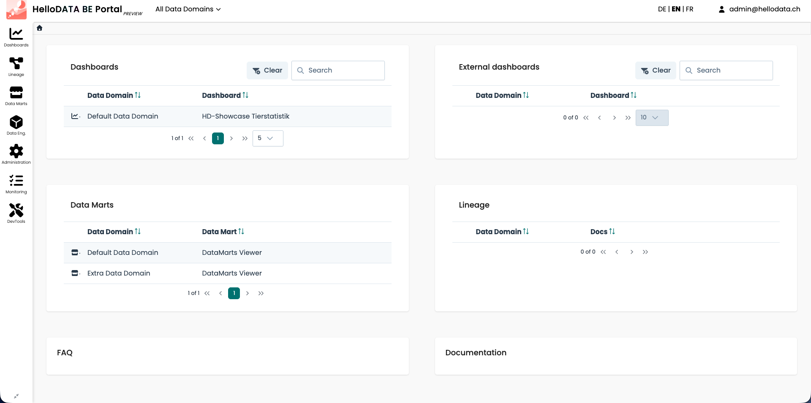

The portal is organized into three areas:

1. **Icon sidebar** (left) – the main navigation. Hovering over an icon expands it and reveals its sub-items. The
   available sections depend on your roles and permissions:
    - **Dashboards** – your Superset dashboards and external dashboards
    - **Lineage** – the dbt documentation and data lineage
    - **Data Marts** – the universal data mart (udm) viewer
    - **Data Eng.** – DWH Viewer, Orchestration, Advanced Analytics and the File Browser
    - **Administration** – user, role, dashboard-access, announcement, FAQ and documentation management
    - **Monitoring** – workspaces and subsystem users
    - **DevTools** – queries, mailbox and file browser
2. **Top bar** – the data-domain switcher (`All Data Domains`), the language switcher (`DE | EN | FR`) and the user menu.
3. **Home page** – an overview of your dashboards, external dashboards, data marts, lineage docs, FAQ and documentation.

#### User menu

In the top-right corner the user menu gives you quick access to your **Profile**, your **Notifications**, system
**Info**, and **Logout**.

#### Business & Data Domain

As explained in [Domain View](../architecture/architecture.md#domain-view), a key feature is to create business domains
with n-data domains. If you have access to more than one data domain, you can switch between them by clicking the
`All Data Domains` drop-down at the top and selecting the domain you want to work in. Most lists and menus are then
filtered to the selected data domain.

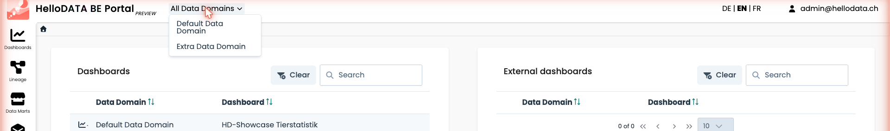

### Dashboards

The **Dashboards** entry in the sidebar is the most important one. Hovering over it reveals the **Dashboard List**, the
dashboards grouped by their Superset instance, the link to open the native Superset instance, the dashboard comments and
the external dashboards.

The dashboard list shows all dashboards you have access to, together with their data domain, business process,
department, professional responsibility, data analyst and publication status. From here you can open a dashboard, see its
details or open it in a new tab.

The overview of your dashboards is also available directly on the home page (see the **Dashboards** and
**External dashboards** panels in the [portal entry page](#portal)).

### Lineage

To see the data lineage (dependencies of your data tables), open the **Lineage** sidebar entry. You can either pick a
specific lineage doc from the hover menu or open the **Lineage Docs List** to see all dbt documentation projects you have
access to.

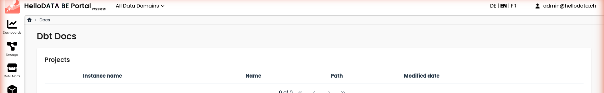

Opening a project brings you to the dbt documentation, where you can see all sources and dbt projects. On the detail page
you can see all the beautiful and helpful documentation such as:

- table name
- columns and data types
- which table and model this selected object depends on
- the SQL code
    - as a template or compiled
- and the dependency graph
    - which you can expand to full view
    - interactive data lineage view

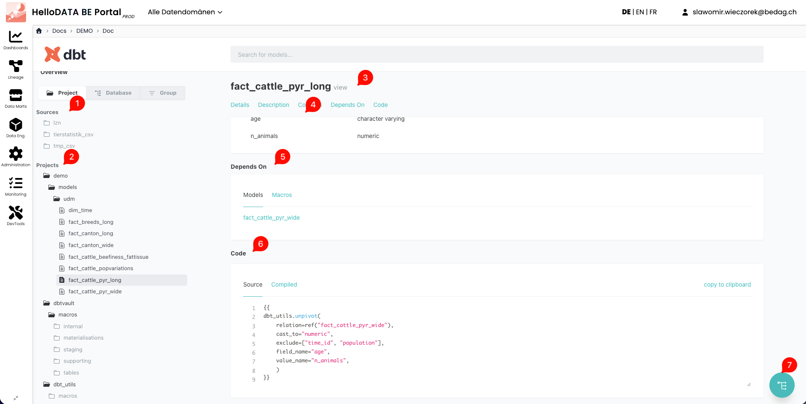
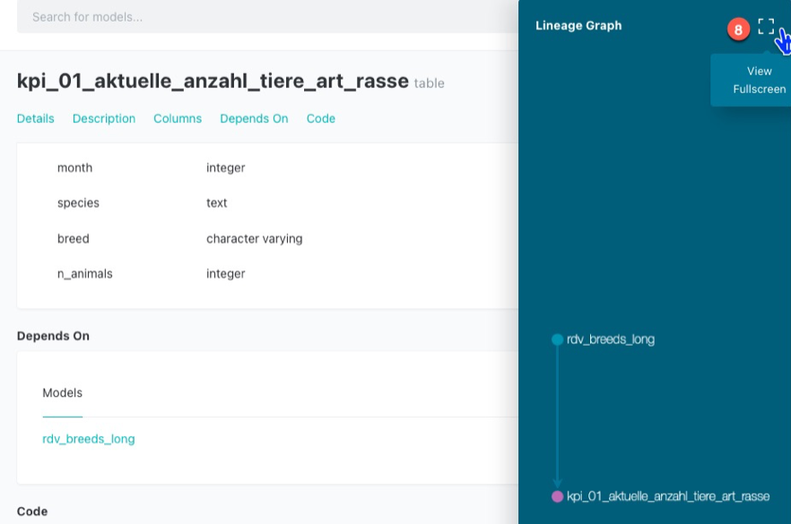
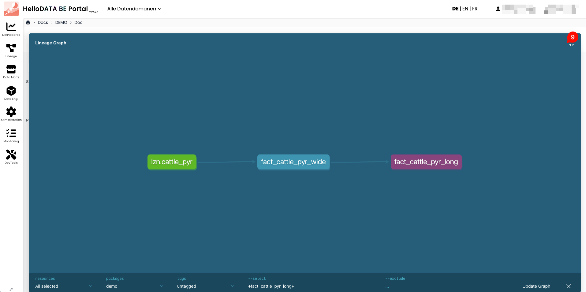

### Data Marts Viewer

This view lets you access the universal data mart (udm) layer. Open the **Data Marts** sidebar entry and choose the
**DM Viewer** for the data domain you want to inspect.

These are cleaned and modeled data mart tables. Data marts are the tables that have been joined and cleaned from the
source tables. This is effectively the latest layer of HelloDATA BE, which the Dashboards are accessing. Dashboards
should not access any layer before (landing zone, data storage, or data processing).

We use CloudBeaver for this, same as the DWH Viewer later.


### Data Engineering

The **Data Eng.** sidebar entry bundles the tools for data engineers: the DWH Viewer, the Orchestration, the Advanced
Analytics (JupyterHub) and the File Browser.

#### DWH Viewer

This is essentially a database access layer where you see all your tables, and you can write SQL queries based on your
access roles with a provided tool ([CloudBeaver](https://github.com/dbeaver/cloudbeaver)).

##### Create new SQL Query


##### Choose Connection and stored queries

You can choose pre-defined connections and query your data warehouse. Also you can store queries that other user can see
and use as well. Run your queries with (1).


##### Settings and Powerful features

You can set many settings, such as user status, and many more.


Please find all settings and features in the [CloudBeaver Documentation](https://dbeaver.com/docs/cloudbeaver/).

#### Orchestration

The orchestrator is your task manager. You
tell [Airflow](https://wiki.bedag.ch/pages/viewpage.action?pageId=1040683176#HDTechArchitecture&Concepts-TaskOrchestration-Airflow),
our orchestrator, in which order the task will run. This is usually done ahead of time, and in the portal, you can see
the latest runs and their status (successful, failed, etc.).

- You can navigate to DAGs and see all the details with the DAG name, owner, runs, schedules, next run and recent.
- You can also dive deeper into Datasets, Security, Admin or similar
- Airflow offers lots of different visualization modes, e.g. the Graph view, that allows you to see each step of this
  task.
    - As you can see, you can choose calendar, task duration, Gantt, etc.

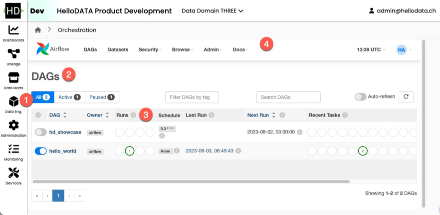
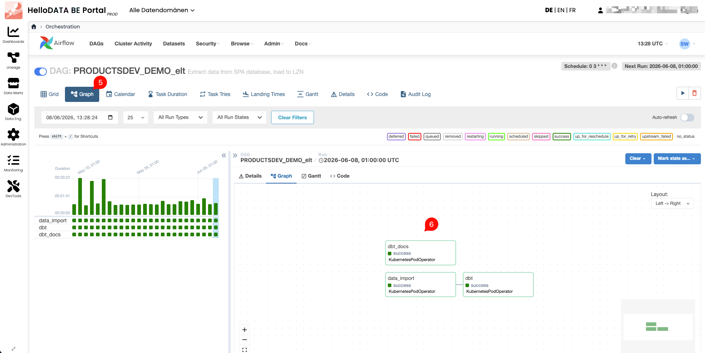

##### Helper Library for Scheduling Jobs on Kubernetes

To unlock the full power of airflow on kubernetes, you will need to run your jobs in containers on the cluster.
To make this a bit easier, we provide a [preinstalled helper library](https://github.com/bedag/hellodata-be-airflow-pod-operator-params) for you to use.

###### Library description

The helper library consists mainly of a function, that returns properly formatted parameters to use with [Airflow's Kubernetes Pod Operator](https://airflow.apache.org/docs/apache-airflow/1.10.10/_api/airflow/contrib/operators/kubernetes_pod_operator/index.html).
It is named `hellodata_be_airflow_pod_operator_params` and can be imported with `import hellodata_be_airflow_pod_operator_params`.
The two public objects are the function `get_pod_operator_params` and the class `EphemeralVolume`.

Call the function `get_pod_operator_params` to get a dictionary with parameters to be passed to `kubernetes_pod_operator`.

| Parameter | Type | Required | Default | Description |
|-----------|------|----------|---------|-------------|
| `image` | `str` | `true` | - | The Docker image to use for the pod |
| `namespace` | `str` | `false` | `"default"` | The Kubernetes namespace in which to create the pod |
| `image_pull_secrets` | `Optional[List[str]]` | `false` | `None` | List of image pull secrets for private registries |
| `secrets` | `Optional[List[str]]` | `false` | `None` | List of Kubernetes secret names to mount in the pod as environment variables |
| `configmaps` | `Optional[List[str]]` | `false` | `None` | List of Kubernetes configmap names to mount in the pod as environment variables |
| `cpus` | `float` | `false` | `1.0` | Number of CPU cores to allocate to the pod |
| `memory_in_Gi` | `float` | `false` | `1.0` | Amount of memory in GiB to allocate to the pod |
| `local_ephemeral_storage_in_Gi` | `float` | `false` | `1.0` | Amount of local ephemeral storage in GiB to allocate to the pod |
| `startup_timeout_in_seconds` | `int` | `false` | `120` | Timeout in seconds for the pod to start up |
| `large_ephemeral_storage_volume` | `Optional[EphemeralVolume]` | `false` | `None` | Large ephemeral storage volume to allocate to the pod |
| `env_vars` | `Optional[Dict[str, str]]` | `false` | `None` | Additional environment variables to set in the pod |

| Parameter      | Type    | Description                                                      |
|----------------|---------|------------------------------------------------------------------|
| `name`         | `str`   | The name of the ephemeral volume.                                |
| `size_in_Gi`   | `float` | The size of the volume in GiB (Gibibytes).                       |
| `mount_path`   | `str`   | The file system path inside the pod where the volume is mounted.  |
| `storage_class`| `str`   | The Kubernetes storage class to use for provisioning the volume.  |

###### Example usage

The following python code contains an Airflow DAG that makes full usage of the library to schedule a pod on airflow.

```python
from datetime import timedelta
from pendulum import datetime
from airflow import DAG
from airflow.providers.cncf.kubernetes.operators.kubernetes_pod import (
    KubernetesPodOperator,
)

from hellodata_be_airflow_pod_operator_params import (
    get_pod_operator_params,
    EphemeralVolume,
)  # library import

operator_params = get_pod_operator_params(
    "alpine:latest",
    namespace="my-namespace",
    secrets=["my-secret"],
    configmaps=["my-configmap"],
    cpus=0.5,
    memory_in_Gi=0.5,
    local_ephemeral_storage_in_Gi=1,
    startup_timeout_in_seconds=10 * 60,
    large_ephemeral_storage_volume=EphemeralVolume(
        "my-storage", 5, "/app/large_ephemeral_storage", "my-storage-type"
    ),
    env_vars={"key": "value"},
)

default_args = {
    "owner": "airflow",
    "depend_on_past": False,
    "start_date": datetime(2025, 8, 1, tz="Europe/Zurich"),
}

with DAG(
    dag_id="example_dag",
    schedule="@once",
    default_args=default_args,
    max_active_runs=1,
    dagrun_timeout=timedelta(minutes=60 * 5),
) as dag:

    my_task = KubernetesPodOperator(
        **operator_params,
        name="my_task",
        task_id="my_task",
        arguments=[
            """
    echo "I run on kubernetes and have the following env vars" &&
    printenv
    """
        ],
    )

```

##### Default DAG: HelloDATA Monitoring

This is a DAG provided by us that gives you a summary of DAG runs. It will send you an email reporting which DAGs
have failed since the monitoring DAG last ran, which have run successfully, which have not run and which are still running.

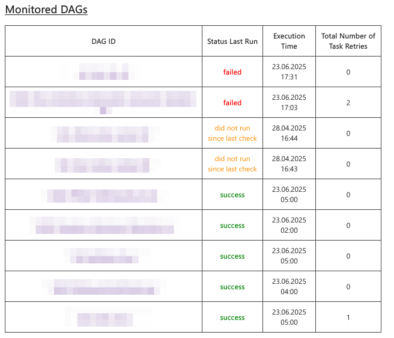

The email contains three sections:
1. **Monitored DAGs** – A table with an overview of DAG runs tagged as `monitored`.
2. **Changes to DAGs** – Lists DAGs that have been paused/unpaused, are new, deleted, newly monitored (added the `monitored` tag) or newly unmonitored.
3. **General Overview** – A table with all DAG runs.

You can modify the behavior of the DAG using environment variables on the Airflow worker:

| Variable Name                    | Default Value                                                                 | Effect                                                                                                                                                                                                                       |
|----------------------------------|------------------------------------------------------------------------------|------------------------------------------------------------------------------------------------------------------------------------------------------------------------------------------------------------------------------|
| `MONITORING_DAG_STATE_FILE`      | `/opt/airflow/dag_state_cache.json`                                          | Path to a file where the state is saved. On Kubernetes, this could be on a PVC to ensure it persists after a pod restart.                                                             |
| `MONITORING_DAG_NOTIFY_EMAIL`    | `moiraine@tarvalon.org,rand.althor@aielwaste.net`                           | Comma-separated list of email addresses to send the report to. Airflow's mail server settings are used for sending the email.                                                         |
| `MONITORING_DAG_AIRFLOW_LINK`    | `your administrator has forgotten to set the MONITORING_DAG_AIRFLOW_LINK env variable` | Value used to generate direct links to the DAG runs.                                                                                                                                  |
| `MONITORING_DAG_INSTANCE_NAME`   | `HelloDATA`                                                                 | Used to generate the email title: `<MONITORING_DAG_INSTANCE_NAME> monitoring, <date and time> - DAG monitoring report`.                                                               |
| `MONITORING_DAG_RUNTIME_SCHEDULE`| `0 5 * * *`                                                                 | [Cron expression](https://en.wikipedia.org/wiki/Cron) for when to run the DAG.                                                                                                        |

#### Prebuilt Mechanism for logging DAG runs

HelloDATA offers an easy way to log your DAG run stats to your DWH database through the `log_dag_run` function in the
preinstalled python package `hellodata_be_dag_logs`. The library is opensource, of course. You can have a look at the code
on [GitHub](https://github.com/bedag/hellodata-be-dag-logs).

##### `log_dag_run` function

The `log_dag_run` function logs statistics for all tasks in the current Airflow DAG run,
excluding any specified task IDs, and inserts this data into a database table.
This helps in monitoring and analyzing DAG performance over time.

**Return type:** `None`
The function does not return a value; it performs logging and database insertion as side effects.

These are the input parameters.

| Parameter         | Type             | Default Value         | Usage                                                                                      |
|-------------------|------------------|-----------------------|--------------------------------------------------------------------------------------------|
| `kwargs`          | `dict[str, Any]` | *required*            | Airflow context dictionary containing information about the current DAG run.               |
| `exclude_task_ids`| `list[str]`      | `[]`                  | List of task IDs to exclude from logging and database insertion.                           |
| `connection_id`   | `str`            | `"default_connection"`| Airflow connection ID used to connect to the target database.                              |
| `schema_name`     | `str`            | `"public"`            | Name of the database schema where the task statistics table resides.                       |
| `table_name`      | `str`            | `"dag_runs_stats"`    | Name of the table where task statistics will be inserted.                                  |

###### Notes

- Ensure your Airflow connection (`connection_id`) is correctly configured for your database.
- The function should be called after the DAG run to capture accurate statistics.
- Adjust parameters as needed for your environment.
- You might want to ignore the task that logs the stats for the logs (see parameter `exclude_task_ids`)

###### Example usage

The following example demonstrates how to use the `log_dag_run` function within an Airflow DAG. It defines several simple tasks and a logging task that records DAG run statistics to a database. The logging task is configured to run after the main tasks, ensuring that all relevant information is captured.

```python
import pendulum
from airflow.decorators import dag, task
from hellodata_be_dag_logs import log_dag_run

@dag(
    schedule=None,
    start_date=pendulum.datetime(2021, 1, 1, tz="UTC"),
    catchup=False,
    tags=["example"],
)
def tutorial_taskflow_api():
    @task(task_id="dt1")
    def dt1():
        return "Some dummy task 1"

    @task(task_id="dt2")
    def dt2():
        return "Some dummy task 2"

    @task(task_id="dt3")
    def dt3():
        return "Some dummy task 3"

    @task(task_id="dt4")
    def dt4():
        return "Some dummy task 4"

    @task(task_id="hd_log_dag_run", provide_context=True)
    def log_stats(**kwargs):
        log_dag_run(
            kwargs,
            connection_id="your-connection-id",
            schema_name="udm",
            table_name="dag_run_stats",
            exclude_task_ids=["hd_log_dag_run"],
        )

    dt1_task = dt1()
    dt2_task = dt2()
    dt3_task = dt3()
    dt4_task = dt4()
    print_context_task = log_stats()
    dt1_task >> dt2_task
    [dt2_task, dt3_task] >> print_context_task

tutorial_taskflow_api()
```

#### Advanced Analytics (JupyterHub)

If you have one of the roles of `HELLODATA_ADMIN`, `BUSINESS_DOMAIN_ADMIN`, or `DATA_DOMAIN_ADMIN`, you can access
**Advanced Analytics** from the **Data Eng.** sidebar entry. It opens JupyterHub for the selected data domain.

That opens up JupyterHub where you choose the base image you want to start with. E.g. you choose Data Science to do ML
workloads, or R if you solely want to work with R. This could look like this:


After you can start creating notebooks with `File -> New -> Notebook`:


After you choose the language (e.g. Python for Python notebooks, or R).

After you can start running commands like you do in Jupyter Notebooks.


See the [official documentation](https://docs.jupyter.org/) for help or functions.

##### Connect to HD Postgres DB

By default, a connection to your own Postgres DB can be made.

The default session time is 24h as of now and can be changed with ENV
`HELLODATA_JUPYTERHUB_TEMP_USER_PASSWORD_VALID_IN_DAYS`.

###### How to connect to the database

This is how to get a db-connection:

```python
from hello_data_scripts import connect # import the function
connection = connect() # use function, it fetches the temp user creds and establishes the connection
```

`connection` can be used to read from postgres.

###### Example

This is a more extensive example of querying the Postgres database. Imagine `SELECT version();` as your custom query or
logic you want to do.

```python
import sys
#import psycopg2 -> this is imported through the below hello_data_scripts import
from hello_data_scripts import connect  

# Get the database connection
connection = connect()

if connection is None:
    print("Failed to connect to the database.")
    sys.exit(1)

try:
    # Create a cursor object
    cursor = connection.cursor()
    
    # Example query to check the connection
    cursor.execute("SELECT version();")
    db_version = cursor.fetchone()
    print(f"Connected to database. PostgreSQL version: {db_version}")
    
except psycopg2.Error as e:
    print(f"An error occurred while performing database operations: {e}")
    
finally:
    # Close the cursor and connection
    cursor.close()
    connection.close()
    print("Database connection closed.")
```

### Administration

Here you manage the portal configuration such as users, dashboard groups, dashboard access, roles, announcements, FAQs,
and documentation. Hover over the **Administration** sidebar entry to see all available sub-items.

#### User Management

The **User management** page is the central place to invite users, synchronize them and manage their permissions.

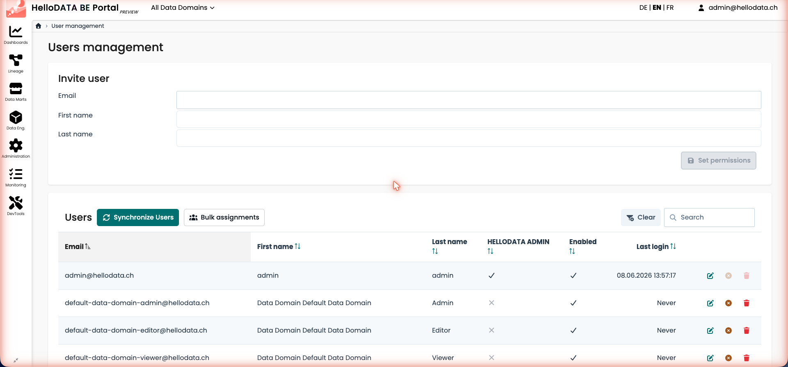

##### Inviting a user

Fill in the **Email**, **First name** and **Last name** in the *Invite user* panel and click **Set permissions** to
create the user and continue to the permission assignment.

##### Synchronizing users

The **Synchronize Users** button reconciles the portal users with the identity provider (Keycloak) and the connected
subsystems.

##### Changing permissions

In the *Users* table you can search for a user and use the action icons on the right of each row to edit the user,
enable/disable it or delete it. The edit icon opens the user's role and data-domain assignment, where you choose the
`role` to grant and the specific data domains to give access to.

See more in [role-authorization-concept](role-authorization-concept.md).

##### Bulk Assignments

For assigning roles, dashboards, and dashboard groups to multiple users at once, use the **Bulk Assignments** wizard
(reachable from the *Users* table). See the dedicated [Bulk Assignments](bulk-assignments.md) guide for a full
walkthrough.

#### Dashboard Groups

Dashboard groups let you bundle dashboards and grant access to a set of users at once, per data domain. Select the data
domain under **Dashboard groups** and use **Create** to define a new group with its dashboards and users.

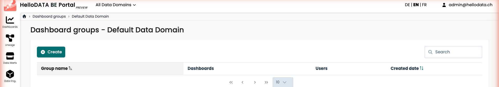

#### Users Overview

The **Users overview** gives you a consolidated, read-only view of all users and their business-domain role across the
platform. You can **Export** the list, **Refresh** it, or **Clear cache** to force a re-fetch. Expand a row to see the
detailed role assignments per context.

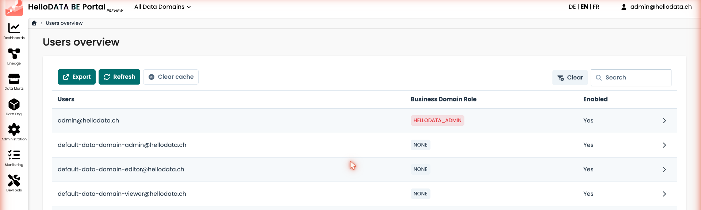

#### Dashboard Access

The **Dashboard access** page is an audit log that shows which user accessed which dashboard and when, including the data
domain. Use the search box to filter the log.

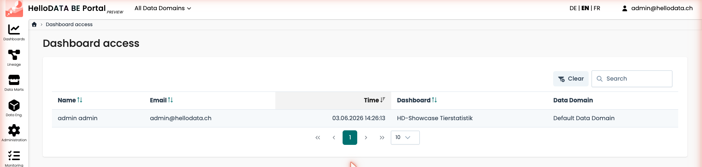

#### Portal Role Management

In **Portal role management** you can see all the roles that exist together with their permissions.

!!! warning

    Creating new roles is not supported. All roles are system roles and are defined and hard coded.

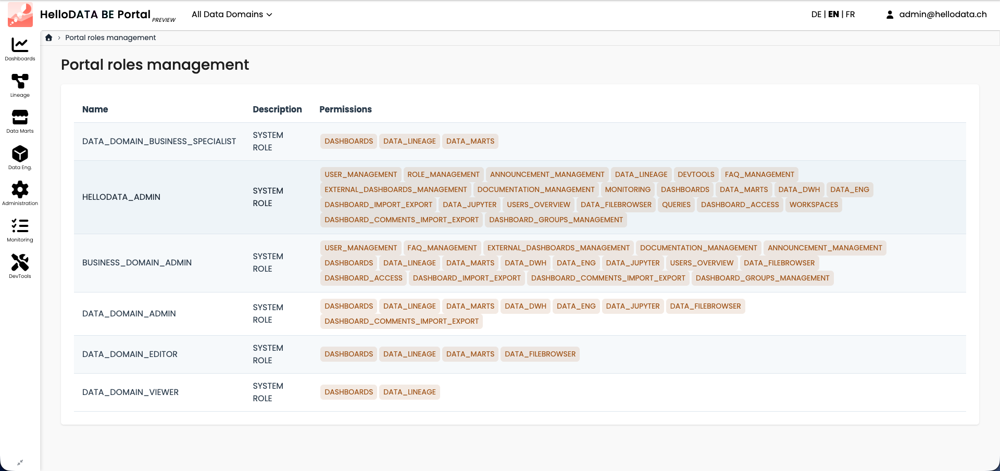

#### Announcements

You can create an announcement (notification) that is shown to all users. Open **Announcements** and click **Create**.
The editor is multilingual — provide the text for **DE**, **EN** and **FR** using the rich-text editor, then toggle
**Published** and **Save**. Published announcements appear at the top of the portal until the user closes them.

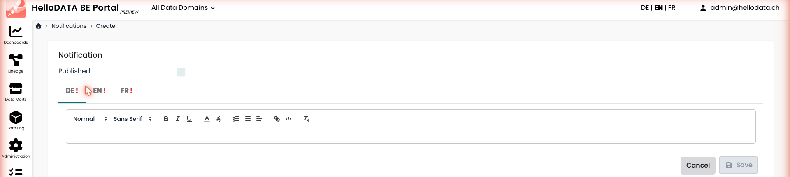

#### FAQ

The FAQ works similarly to the announcements. Open **FAQ management**, click **Create**, choose the **Data Domain** the
FAQ should apply to (or *All Data Domains*), enter a **Title** and the content for each language. FAQs are shown on the
home page.

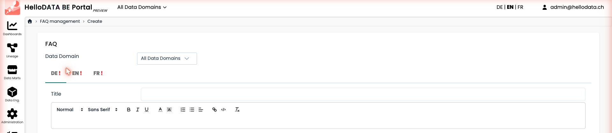

#### Documentation Management

With **Documentation management** you maintain a single documentation entry that everyone with the permission can edit.
The editor is multilingual (**DE / EN / FR**) and the content is shown on the home page.

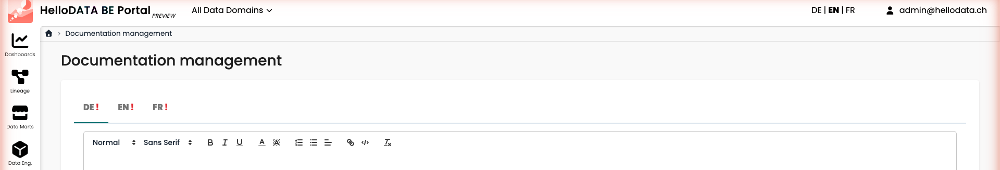

#### Dashboard Import / Export

The **Dashboard import-export** page lets administrators export dashboards from a data domain and import them into
another. Each data domain has its own **Export** / **Import** controls and a table where you select the dashboards to
transfer, together with their metadata (business process, department, professional responsibility, data analyst).

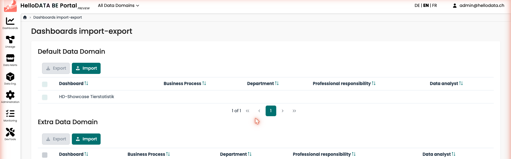

### Monitoring

The **Monitoring** sidebar entry bundles the workspaces overview and the subsystem users.

#### Workspaces

The **Workspaces** page gives you a single entry point to every connected subsystem and its native application — Airflow,
CloudBeaver, dbt docs, JupyterHub, SFTPGo and the Superset instances per data domain. Click a card to open the
corresponding tool.

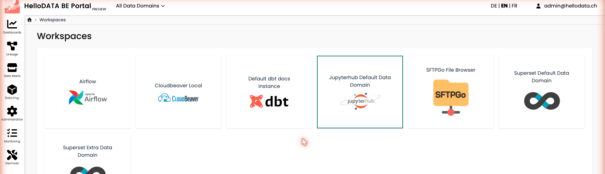

#### Subsystem Users

The **Subsystem users** page lets you observe and reconcile users across the connected subsystems. You can **Export** the
list, **Export for batch import**, **Refresh** or **Clear cache**, and expand a user to see their state in each
subsystem.

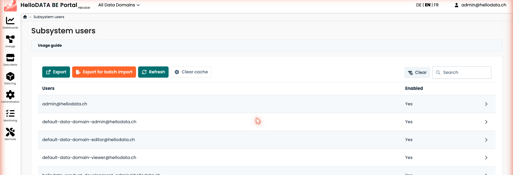

### DevTools

DevTools are additional tools HelloDATA provides out of the box: the query history, a mailbox and a file browser.

#### Queries

The **Queries** page shows the history of SQL queries executed against the data warehouse, with their status, time,
duration, originating tab, database, schema, tables and the user who ran them.

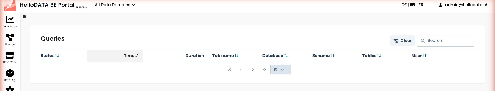

#### Mailbox

You can check in Mailbox (we use [MailHog](https://github.com/mailhog/MailHog)) what emails have been sent or what
accounts are updated.

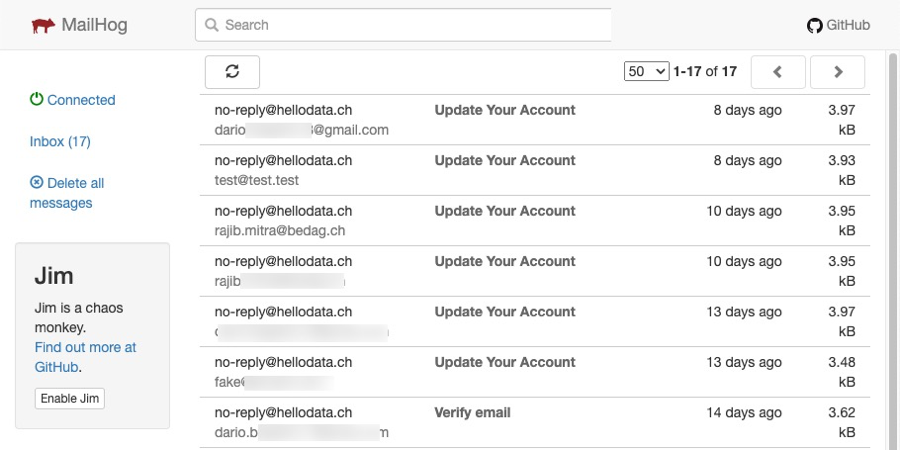

#### FileBrowser

Here you can browse all the documentation or code from the git repos as file browser. We
use [SFTPGo](https://github.com/drakkan/sftpgo) here. Please use with care, as some of the folders are system relevant.

!!! note "Log in"

    Make sure you have the login credentials to log in. Your administrator should be able to provide these to you.

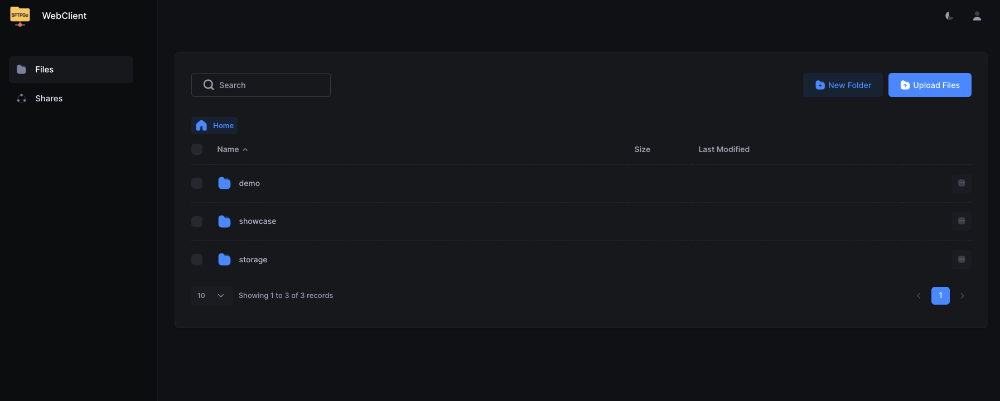

## More: Know-How

- More help for Superset
    - [Superset Documentation](https://superset.apache.org/docs/intro/)
- More help for dbt:
    - [dbt Documentation](https://docs.getdbt.com/docs/collaborate/documentation)
    - [dbt Developer Hub](https://docs.getdbt.com/)
- More about Airflow
    - [Airflow Documentation](https://airflow.apache.org/docs/)
- More about SFTPGo
    - [SFTPGo Documentation](https://docs.sftpgo.com/2.6/)

Find further important references, know-how, and best practices
on [HelloDATA Know-How](https://confluence.bedag.ch/x/4wHXE).
